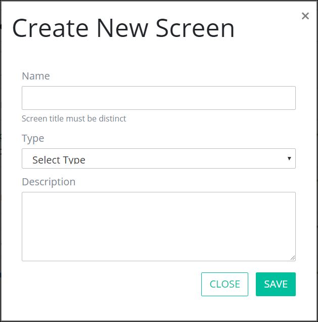

# Create a New Screen


To create a new ProcessMaker Screen, you must be a member of the Process Owner group. Otherwise, the **Processes** option is not available from the top menu that allows you to perform Screen management activities.


## Create a New ProcessMaker Screen

Follow these steps to create a new ProcessMaker Screen:

1. [View your ProcessMaker Screens.](manage-forms/view-all-forms.md) The **Screens** page displays.
2. Click the **+SCREEN** button. The **Create New Screen** page displays.  

   

3. Enter in the **Name** field the name of the ProcessMaker Screen. ~~Character length limitation and/or unsupported characters?~~ This is a required field.
4. Select from **Type** drop-down the type of ProcessMaker Screen to create. For information about ProcessMaker Screen types, see [Screen Types](screens-builder/types-for-screens.md).
5. Enter in the **Description** field a description for the ProcessMaker Screen. This does not seem to be a required field. ~~Character length limitation and/or unsupported characters?~~
6. Click **Save**. Screens Builder displays the new ProcessMaker Screen in Editor mode. For information how to develop your ProcessMaker Screen, see [Screens Builder](screens-builder/).

## Related Topics













