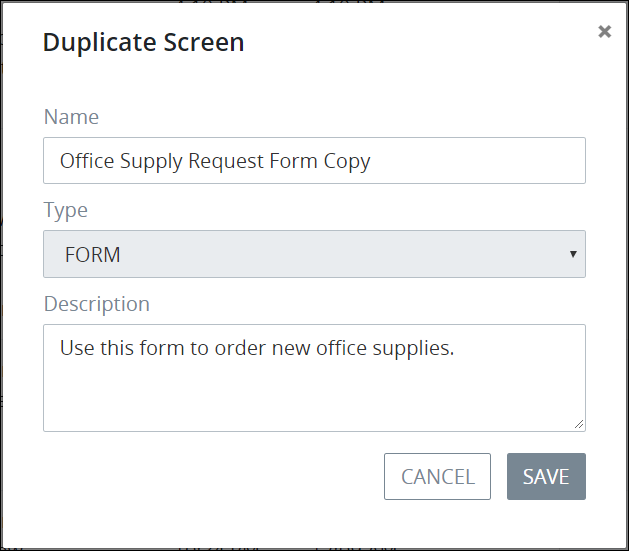

# Duplicate a Screen

## Duplicate a ProcessMaker Screen


Your user account or group membership must have the following permissions to duplicate a ProcessMaker Screen's configuration:

* Screens: View Screens
* Screens: Create Screens

See the ProcessMaker [Screens](../../../processmaker-administration/permission-descriptions-for-users-and-groups.md#screens) permissions or ask your ProcessMaker Administrator for assistance.


Follow these steps to duplicate a ProcessMaker Screen:

1. [View your ProcessMaker Screens.](view-all-forms.md) The **Screens** page displays.
2. Select the **Duplicate** iconfor your ProcessMaker Screen. The **Duplicate Screen** screen displays.  

   

3. Edit the following information from the original ProcessMaker Screen as necessary:
   * In the **Name** field, edit the name of the duplicated ProcessMaker Screen. After the original ProcessMaker Screen is duplicated, the word **Copy** is suffixed to the original Screen's name. This is a required field.
   * In the **Description** field, edit the description from the original ProcessMaker Screen.
4. Click **Save**.


The **Type** field shows which [type](../screens-builder/types-for-screens.md) the original ProcessMaker Screen is. The duplicate ProcessMaker Screen must be of the same type.


## Related Topics















