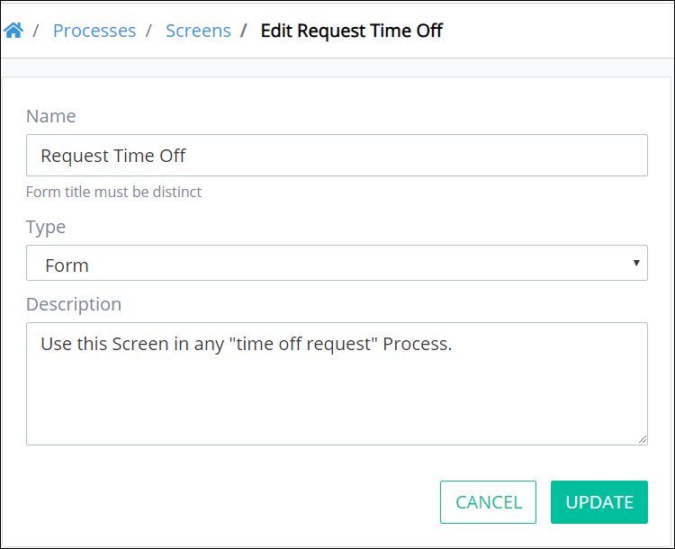

# Edit a Screen


To edit a ProcessMaker Screen, you must be a member of the Process Owner group. Otherwise, the **Processes** option is not available from the top menu that allows you to perform Screen management activities.


## Edit a ProcessMaker Screen

Follow these steps to edit a ProcessMaker Screen:

1. [View your ProcessMaker Screens.](view-all-forms.md) The **Screens** page displays.
2. Hover your cursor over the ProcessMaker Screen to edit and then click the **Edit** icon. The **Edit Screen** page displays.  

   

3. Edit the name of the ProcessMaker Screen in the **Name** field if necessary.
4. Edit the description of the ProcessMaker Screen in the **Description** field if necessary.
5. Click **Update**. Otherwise, click **Cancel** to cancel any changes.

## Related Topics













