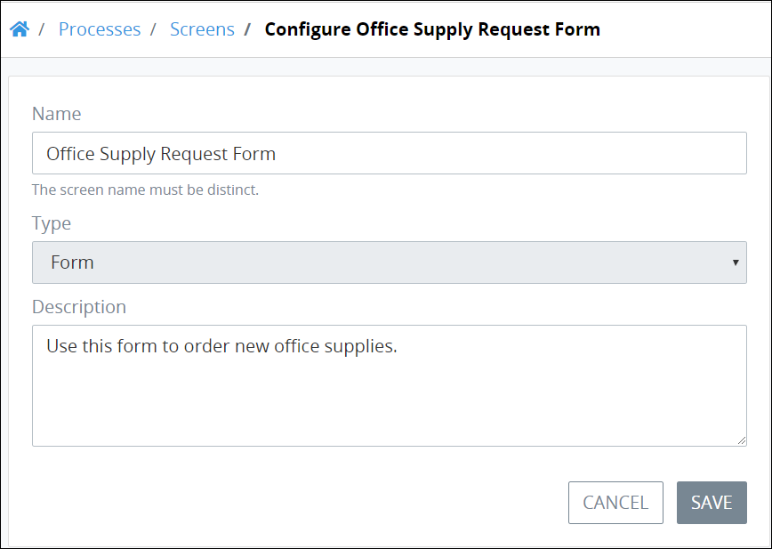

# Configure a Screen

## Configure a ProcessMaker Screen


Your user account or group membership must have the following permissions to edit a ProcessMaker Screen's configuration:

* Screens: View Screens
* Screens: Edit Screens

See the ProcessMaker [Screens](../../../processmaker-administration/permission-descriptions-for-users-and-groups.md#screens) permissions or ask your ProcessMaker Administrator for assistance.


Follow these steps to configure a ProcessMaker Screen:

1. [View your ProcessMaker Screens.](view-all-forms.md) The **Screens** page displays.
2. Select the **Configure** iconfor your ProcessMaker Screen. The **Configure** page displays.  

   

3. Edit the following information about the ProcessMaker Screen as necessary:
   * In the **Name** field, edit the name of the ProcessMaker Screen. This is a required field.
   * ~~In the **Type** drop-down, select the type of ProcessMaker Screen. This is a required field. See~~ [~~Screen Types~~](../screens-builder/types-for-screens.md)~~.~~
   * In the **Description** field, edit the description of the ProcessMaker Screen. This is a required field.
4. Click **Save**.


~~The **Type** field shows of which type the ProcessMaker Screen is. After the ProcessMaker Screen has been created, its type cannot be changed.~~


## Related Topics















