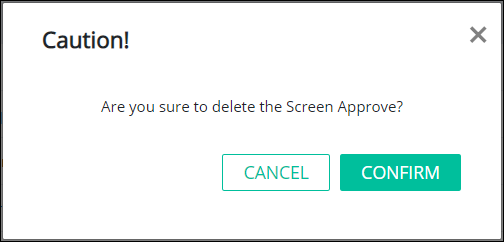

# Remove a Screen


To remove a ProcessMaker Screen, you must be a member of the Process Owner group. Otherwise, the **Processes** option is not available from the top menu that allows you to perform Screen management activities.


## Remove a ProcessMaker Screen


When a ProcessMaker Screen is removed ~~describe what happens and in which conditions a process can be removed.~~

Removing a ProcessMaker Screen from the **Screens** page cannot be undone.


Follow these steps to remove a ProcessMaker Screen:

1. [View your ProcessMaker Screens.](view-all-forms.md) The **Screens** page displays.
2. Hover your cursor over the ProcessMaker Screen to remove and then click the **Remove** icon. The **Caution** screen displays to confirm the removal of the ProcessMaker Screen.

   

3. Click **Confirm** to remove the ProcessMaker Screen. Otherwise, click **Cancel** to not remove the ProcessMaker Screen.

## Related Topics











