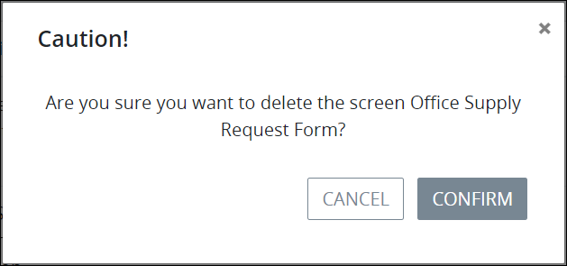

# Delete a Screen

## Delete a ProcessMaker Screen


Your user account or group membership must have the following permissions to delete a ProcessMaker Screen:

* Screens: View Screens
* Screens: Delete Screens

See the ProcessMaker [Screens](../../../processmaker-administration/permission-descriptions-for-users-and-groups.md#screens) permissions or ask your ProcessMaker Administrator for assistance.



When a ProcessMaker Screen is deleted, Process models that use that ProcessMaker Screen in [Task elements](../../process-design/model-your-process/add-and-configure-task-elements.md#select-the-processmaker-screen-for-a-task-element) are not affected. However, that ProcessMaker Screen can no longer be added to other Process models.

Deleting a ProcessMaker Screen from the **Screens** page cannot be undone.


Follow these steps to delete a ProcessMaker Screen:

1. [View your ProcessMaker Screens.](view-all-forms.md) The **Screens** page displays.
2. Select the **Delete** iconfor your ProcessMaker Script. The **Caution** screen displays to confirm the deletion of the ProcessMaker Screen.  

   

3. Click **Confirm**.

## Related Topics















