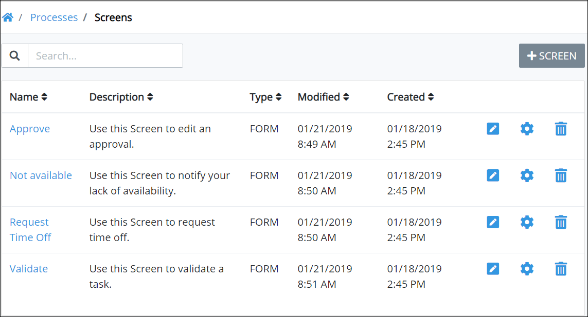

# View All Screens

ProcessMaker displays all Screens in one location. Any ProcessMaker Screen developed by any Process Owner can be used in any Process model. This makes it easy to manage ProcessMaker Screens.

## View All ProcessMaker Screens 


Your user account or group membership must have the "Screens: View Screens" permission to view the list of ProcessMaker Screens.

Ask your ProcessMaker Administrator for assistance if necessary.


Follow these steps to view all ProcessMaker Screens in your organization:

1. ​[Log in](https://processmaker.gitbook.io/processmaker-4-community/-LPblkrcFWowWJ6HZdhC/using-processmaker/log-in#log-in) to ProcessMaker.
2. Click the **Processes** option from the top menu. The **Processes** page displays.
3. Click the **Screens** icon. The **Screens** page displays all ProcessMaker Screens.

The **Screens** page displays the following information about ProcessMaker Screens:

* **Name:** The **Name** column displays the name of the ProcessMaker Screen. Click the name to edit the ProcessMaker Screen in [Screens Builder](../screens-builder/).
* **Description:** The **Description** column displays the description of the ProcessMaker Screen. See [Edit Script Configuration](../../scripts/manage-scripts/edit-script-configuration.md#edit-configuration-information-about-a-processmaker-script) for more information.
* **Type:** The **Type** column displays which type the ProcessMaker Screen is. See [Screen Types](../screens-builder/types-for-screens.md).
* **Modified:** The **Modified** column displays the date and time the ProcessMaker Screen was last modified. The time zone setting to display the time is according to the ProcessMaker 4 server unless your [user profile's](../../../using-processmaker/profile-settings.md#change-your-profile-settings) **Time zone** setting is specified.
* **Created:** The **Created** column displays the date and time the ProcessMaker Screen was created. The time zone setting to display the time is according to the ProcessMaker 4 server unless your [user profile's](../../../using-processmaker/profile-settings.md#change-your-profile-settings) **Time zone** setting is specified.


### Search for a ProcessMaker Screen

Use the [Search](search-for-a-screen.md#search-for-a-processmaker-screen) field to filter ProcessMaker Screens that display.

### No ProcessMaker Screens?

If no ProcessMaker Screens exist, the following message displays: **No Data Available**.

### Edit a ProcessMaker Screen

Do one of the following:

* **Edit the ProcessMaker Screen:** Click the **Open Editor** icon. See [Screens Builder](../screens-builder/) for topics.
* **Edit the Screen Configuration:** Click the **Config** icon. See [Edit Screen Configuration](edit-a-screen.md#edit-configuration-information-about-a-processmaker-screen).

### Delete a ProcessMaker Screen

Click the **Remove** icon. See [Delete a Screen](remove-a-screen.md#delete-a-processmaker-screen).

### Display Information the Way You Want It

[Control how tabular information displays](../../../using-processmaker/control-how-requests-display-in-a-tab.md), including how to sort columns or how many items display per page.


## Related Topics















