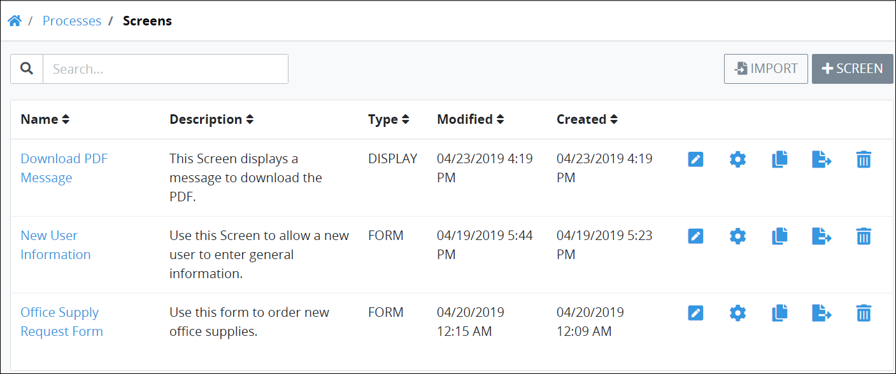

# View All Screens

ProcessMaker displays all Screens in one page that Process Owners throughout your organization have created. Any ProcessMaker Screen developed by any Process Owner can be used in any Process model. This makes it easy to manage ProcessMaker Screens.

## View All ProcessMaker Screens 


Your user account or group membership must have the "Screens: View Screens" permission to view the list of ProcessMaker Screens.

Ask your ProcessMaker Administrator for assistance.


Follow these steps to view all ProcessMaker Screens in your organization:

1. ​[Log in](https://processmaker.gitbook.io/processmaker-4-community/-LPblkrcFWowWJ6HZdhC/using-processmaker/log-in#log-in) to ProcessMaker.
2. Click the **Processes** option from the top menu. The **Processes** page displays.
3. Click the **Screens** icon. The **Screens** page displays all ProcessMaker Screens in your organization.

The **Screens** page displays the following information about ProcessMaker Screens:

* **Title:** The **Title** column displays the name of the ProcessMaker Screen. Click the ProcessMaker Screen to to edit the ProcessMaker Screen in Screen Builder. For more information how to set the name for a ProcessMaker Screen, see [Create a New Screen](../create-a-new-form.md). For information how to change the name for a ProcessMaker Screen, see [Rename or Close a Screen Page]().
* **Description:** The **Description** column displays the description about the ProcessMaker Screen. For information how to edit the ProcessMaker Screen description, see [Edit a Screen](edit-a-screen.md).
* **Type:** The **Type** column displays which type the ProcessMaker Screen is. For information about ProcessMaker Screen types, see [Screen Types](../screens-builder/types-for-screens.md).
* **Modified:** The **Modified** column displays the date and time the ProcessMaker Screen was last modified.
* **Created:** The **Created** column displays the date and time the ProcessMaker Screen was created.


For information how to search for a ProcessMaker Screen, see [Search for a Screen](search-for-a-screen.md).



If no ProcessMaker Screens exist, the following message displays: ~~**You don't have any screens. Please click on '+SCREEN' to get started**~~**.**



[Control how tabular information displays.](../../../using-processmaker/control-how-requests-display-in-a-tab.md)


## Related Topics















