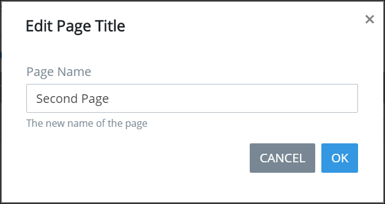

# Add, Remove or Rename a Page

Process Owners can create multi-page [Form-type](types-for-screens.md) ProcessMaker Screens. By default, a ProcessMaker Screen contains one page that has the same name as the ProcessMaker Screen. ~~All Form-type ProcessMaker Screens must have at least one page.~~

Each page has its own name. ~~Screen Editor page names do not need to be unique on the same ProcessMaker Screen.~~

## Add a New Page to a ProcessMaker Screen

Follow these steps to add a new page to a ProcessMaker Screen:

1. [Create](../create-a-new-form.md) or [open the ProcessMaker Screen from the **Screens** page](../manage-forms/view-all-forms.md) in which to add a new page. The ProcessMaker Screen is in Editor mode.
2. Click the **+ Add Page** button. The **Add New Page** screen displays.  

   

3. Enter in the **Page Name** field the name of the new page. ~~Should this be a unique name for the ProcessMaker Screen?~~
4. Click **OK**. Otherwise, click **Cancel** to not add a new page.

## Remove a Page from a ProcessMaker Screen

Follow these steps to remove a page from a ProcessMaker Screen:

1. [Open the ProcessMaker Screen from the **Screens** page](../manage-forms/view-all-forms.md) in which to remove a page. The ProcessMaker Screen is in Editor mode.
2. Locate the name of the page you want to remove and then click the iconon that page's tab. ~~What happens next?~~

## Rename a Page

Follow these steps to rename a page on a ProcessMaker Screen:

1. [Create](../create-a-new-form.md) or [open the ProcessMaker Screen from the **Screens** page](../manage-forms/view-all-forms.md) in which to add a new page. The ProcessMaker Screen is in Editor mode.
2. Click **Edit** on the tab in which to rename its page. The **Edit Page Title** screen displays.  

   

3. Edit in the **Page Name** field the name of the page.
4. Click **OK**. Otherwise, click **Cancel** to not rename the page.

## Related Topics









