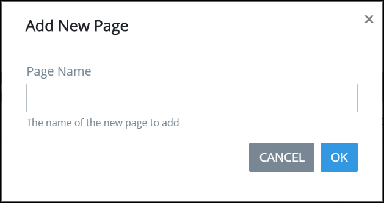

# Add or Remove a Page to a Screen

Process Owners can create multi-page ProcessMaker Screens. By default, a ProcessMaker Screen contains one page that has the same name as the ProcessMaker Screen.

## Add a New Page to a ProcessMaker Screen

Follow these steps to add a new page to a ProcessMaker Screen:

1. [Create](../create-a-new-form.md) or [open the ProcessMaker Screen from the **Screens** page](../manage-forms/view-all-forms.md) in which to add a new page. The ProcessMaker Screen is in Editor mode.
2. Click the **+ Add Page** button. The **Add New Page** screen displays.  

   

3. Enter in the **Page Name** field the name of the new page. ~~Should this be a unique name for the ProcessMaker Screen?~~
4. Click **OK**. Otherwise, click **Cancel** to not add a new page.

## Remove a Page from a ProcessMaker Screen

