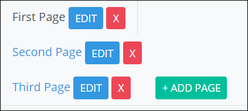

# Add, Delete or Rename a Page

Process Owners can create multi-page [Form-type](types-for-screens.md) ProcessMaker Screens. By default, a ProcessMaker Screen contains one page that has the same name as the ProcessMaker Screen.

Each page has its own name. ~~Screen Editor page names must be unique on the same ProcessMaker Screen.~~

## Add a New Page to a ProcessMaker Screen


Your user account or group membership must have the following permissions to add a new page to a ProcessMaker Screen:

* Screens: View Screens
* Screens: Edit Screens

Ask your ProcessMaker Administrator for assistance if necessary.


Follow these steps to add a new page to a ProcessMaker Screen:

1. [Create](../create-a-new-form.md) or [open the ProcessMaker Screen from the **Screens** page](../manage-forms/view-all-forms.md) in which to add a new page. The ProcessMaker Screen is in [Editor mode](screens-builder-modes.md#editor-mode).
2. Click the **+ Add Page** button. The **Add New Page** screen displays.  

   

3. In the **Page Name** field, enter the name of the new page. ~~Screen Editor page names must be unique on the same ProcessMaker Screen.~~
4. Click **OK**. The new page displays in a new vertical tab.

Access each page from its tab. The selected page displays in black-colored text. Other pages displays in blue-colored text.

## Delete a Page from a ProcessMaker Screen


Your user account or group membership must have the following permissions to delete a new page to a ProcessMaker Screen:

* Screens: View Screens
* Screens: Edit Screens

Ask your ProcessMaker Administrator for assistance if necessary.


Follow these steps to delete a page from a ProcessMaker Screen:

1. [Open the ProcessMaker Screen from the **Screens** page](../manage-forms/view-all-forms.md) in which to delete a page. The ProcessMaker Screen is in [Editor mode](screens-builder-modes.md#editor-mode).
2. Locate the name of the page you want to delete and then click the iconon that page's tab. ~~What happens next?~~

## Rename a Page


Your user account or group membership must have the following permissions to rename a new page to a ProcessMaker Screen:

* Screens: View Screens
* Screens: Edit Screens

Ask your ProcessMaker Administrator for assistance if necessary.


Follow these steps to rename a page on a ProcessMaker Screen:

1. [Create](../create-a-new-form.md) or [open the ProcessMaker Screen from the **Screens** page](../manage-forms/view-all-forms.md) in which to add a new page. The ProcessMaker Screen is in [Editor mode](screens-builder-modes.md#editor-mode).
2. Click **Edit** on the tab in which to rename its page. The **Edit Page Title** screen displays.  

   

3. Edit in the **Page Name** field the name of the page.
4. Click **OK**.

## Related Topics









