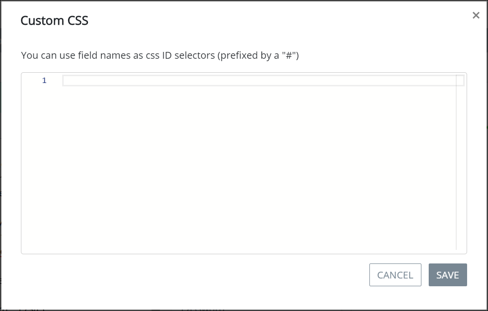

# Add Custom CSS to a Screen

## Add Custom CSS to a ProcessMaker Screen

Use the Custom CSS mode to add custom CSS styles to a ProcessMaker Screen.


Your user account or group membership must have the following permissions to add custom CSS to a ProcessMaker Screen:

* Screens: View Screens
* Screens: Edit Screens

See the ProcessMaker [Screens](../../../processmaker-administration/permission-descriptions-for-users-and-groups.md#screens) permissions or ask your ProcessMaker Administrator for assistance.


Follow these steps to add custom CSS to a ProcessMaker Screen:

1. [Open](../manage-forms/view-all-forms.md) the ProcessMaker Screen in which to add custom CSS. The ProcessMaker Screen is in [Editor mode](screens-builder-modes.md#editor-mode).
2. Click the **Custom CSS** option from Screen Builder's top menu. The **Custom CSS** screen displays.  

   

3. Enter your custom CSS in valid Cascading Style Sheet language. Address any language errors as necessary.
4. Click **Save**.

## Related Topics























