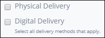

# Checkbox Control Settings

## Control Description

The Checkbox control adds a checkbox from which the form user can select or deselect an option. Multiple Checkbox controls can be grouped together to function as one set of options whereby separate Checkbox controls with the same name maintain the same selected or deselected state.


This control is not available for [Display](../types-for-screens.md#display)-type ProcessMaker Screens. See [Screen Types](../types-for-screens.md).


## Add the Control to a ProcessMaker Screen


Your user account or group membership must have the following permissions to add a control to a ProcessMaker Screen:

* Screens: View Screens
* Screens: Edit Screens

See the ProcessMaker [Screens](../../../../processmaker-administration/permission-descriptions-for-users-and-groups.md#screens) permissions or ask your ProcessMaker Administrator for assistance.


Follow these steps to add this control to the ProcessMaker Screen:

1. [Create](../../manage-forms/create-a-new-form.md) or [open](../../manage-forms/view-all-forms.md) the ProcessMaker Screen. The ProcessMaker Screen is in [Editor mode](../screens-builder-modes.md#editor-mode).
2. View the ProcessMaker Screen page to which to add the control.
3. Go to the **Controls** panel on the left side of the ProcessMaker Screen.
4. Drag the **Checkbox** icon  from the **Controls** panel anywhere within the ProcessMaker Screen canvas represented by the dotted-lined box. Existing controls on the ProcessMaker Screen canvas adjust positioning based on where you drag the control.
5. Drop into the ProcessMaker Screen where you want the control to display on the page.  

   

6. Configure the Checkbox control. See [Inspector Settings](checkbox-control-settings.md#inspector-settings).

Below are two Checkbox controls in Preview mode.

## Delete the Control from a ProcessMaker Screen


Deleting a control also deletes configuration for that control. If you add another control, it will have default settings.


Click the **Delete** iconfor the control to delete it.

## Inspector Settings 


### Don't Know What the Inspector Panel Is?

See [View the Inspector Panel](../view-the-inspector-pane.md).

### Permissions Required to View Control Settings

Your user account or group membership must have the following permissions to edit a ProcessMaker Screen control:

* Screens: View Screens
* Screens: Edit Screens

See the ProcessMaker [Screens](../../../../processmaker-administration/permission-descriptions-for-users-and-groups.md#screens) permissions or ask your ProcessMaker Administrator for assistance.


Below are Inspector settings for the Checkbox control:

* **Field Name:** Specify the unique internal data name of the control that only the Process Owner views at design time. Multiple Checkbox controls can be grouped together to function as one set of options whereby separate Checkbox controls with the same **Field Name** value maintain the same selected or deselected state. This is a required setting. Use the **Field Name** value for this control to reference it in [**Show If** setting expressions](expression-syntax-components-for-show-if-control-settings.md).
* **Field Label:** Specify the field label text that displays. **New Checkbox** is the default value.
* **Help Text:** Specify text that provides additional guidance on the field's use. This setting has no default value.
* **Initially Checked?:** Select to indicate that the Checkbox control is checked \(selected\) by default. Otherwise, deselect to indicate that the Checkbox control is not checked by default. This setting is not selected by default.
* **Background Color:** Select to specify the background color of the Checkbox control. Selecting a background color also selects the **Background Color** checkbox.
* **Text Color:** Select to specify the text color that displays in the control. Selecting a text color also selects the **Text Color** checkbox.
* **Show If:** Specify an expression that dictates the condition\(s\) under which the Checkbox control displays. See [Expression Syntax Components for "Show If" Control Settings](expression-syntax-components-for-show-if-control-settings.md#expression-syntax-components-for-show-if-control-settings). If this setting does not have an expression, then this control displays by default.

## Related Topics 



































