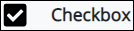
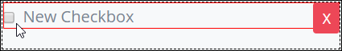

# Checkbox Control Settings

## Control Description

The Checkbox control adds a checkbox from which the form user can select or deselect an option. Multiple Checkbox controls can be grouped together.

## Add the Control to a ProcessMaker Screen

Follow these steps to add this control to the ProcessMaker Screen:

1. View the ProcessMaker Screen page to which to add the control.
2. Go to the **Controls** panel on the left side of the ProcessMaker Screen.
3. Drag the **Checkbox** icon  from the **Controls** panel to the ProcessMaker Screen page.
4. Drop into the ProcessMaker Screen where you want the control to display on the page.  

   

## Inspector Settings 


For information how to view the **Inspector** panel, see [View the Inspector Panel](../view-the-inspector-pane.md).


Below are Inspector settings for the Radio Group control:

* **Field Name:** Specify the internal data name of the control that only the Process Owner views at design time. Use the same **Field Name** value in multiple Checkbox controls to group Checkbox controls with the same **Field Name** value together such that when one in the group is selected, all others are automatically deselected. ~~This is a required setting.~~
* **Field Label:** Specify the field label text displayed to the form user.  Set by default as **New Checkbox**.
* **Help Text:** Specify text that provides additional guidance on the field's use.
* **Initially Checked?:** Select to indicate that the Checkbox control should be checked \(selected\) by default. Otherwise, deselect to indicate that the Checkbox control is not checked.

## Related Topics 





