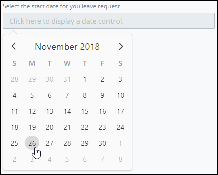

# Date Picker Control Settings

## Control Description 

The Date Picker control allows the form user to click the control and select a date from a calendar pop-up. After the user selects a date from the control, the calendar hides and the control shows the selected date using the `mm/dd/yyyy` text format.


This control is not available for [Display](../types-for-screens.md#display)-type ProcessMaker Screens. See [Screen Types](../types-for-screens.md) for more information.


## Add the Control to a ProcessMaker Screen 

Follow these steps to add this control to the ProcessMaker Screen:

1. View the ProcessMaker Screen page to which to add the control.
2. Go to the **Controls** panel on the left side of the ProcessMaker Screen.
3. Drag the **Date Picker** icon  from the **Controls** panel to the ProcessMaker Screen page.
4. Drop into the ProcessMaker Screen where you want the control to display on the page.

   

Below is a Date control in Preview mode.

## Inspector Settings 


For information how to view the **Inspector** panel, see [View the Inspector Panel](https://processmaker.gitbook.io/processmaker-4-community/-LPblkrcFWowWJ6HZdhC/designing-processes/design-forms/screens-builder/view-the-inspector-pane).


Below are Inspector settings for the Date Picker control:

* **Field Name:** Specify the internal data name of the control that only the Process Owner views at design time. This is a required setting.
* **Field Label:** Specify the field label text displayed to the form user. Set by default as **New Date Picker**.
* **Placeholder:** Specify the placeholder text that displays in the field when no value has been provided.

## Related Topics 







