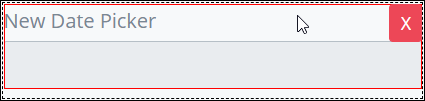

# Date Picker Control Settings

## Control Description 

Clicking on a Date Picker control opens a calendar popup where users can easily select and input a date. 

## Add the Control to a ProcessMaker Screen 

Follow these steps to add this control to the ProcessMaker Screen:

1. View the ProcessMaker Screen page to which to add the control.
2. Go to the **Controls** panel on the left side of the ProcessMaker Screen.
3. Drag the **Date Picker** icon  from the **Controls** panel to the ProcessMaker Screen page.
4. Drop into the ProcessMaker Screen where you want the control to display on the page.

   ​  ​

## Inspector Settings 


For information how to view the **Inspector** panel, see [View the Inspector Panel](https://processmaker.gitbook.io/processmaker-4-community/-LPblkrcFWowWJ6HZdhC/designing-processes/design-forms/screens-builder/view-the-inspector-pane).


Below are Inspector settings for the Text control:

* **Text Label:** Specify what text displays for the Text control. Set by default as **New Text**. You can change what text will display.
* **Font Weight:** Sets the weight of the **Text Label** text. Set by default as **Normal**. You can change to **Bold**.
* **Font Size:** Sets the size of the **Text Label** text in em units. Set by default as **1**. You can change the font size to the following options:
  * 0.5
  * 1
  * 1.5
  * 2

