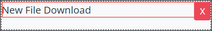

# File Download Control Settings

## Control Description

The File Download control adds an area in the ProcessMaker Screen from which the form user can download one or more files to a local computer. The downloaded file\(s\) can be referenced from a previous step in the Request.

## Add the Control to a ProcessMaker Screen 

Follow these steps to add this control to the ProcessMaker Screen:

1. View the ProcessMaker Screen page to which to add the control.
2. Go to the **Controls** panel on the left side of the ProcessMaker Screen.
3. Drag the **File Download** iconfrom the **Controls** panel anywhere within the ProcessMaker Screen canvas represented by the dotted-lined box. Existing controls on the ProcessMaker Screen canvas adjust positioning based on where you drag the control.
4. Drop into the ProcessMaker Screen where you want the control to display on the page.  

   

Below is a File Download control in Preview mode. ~~ADD THE FILE DOWNLOAD PREVIEW AFTER THE CONTROL HAS A PREVIEW REPRESENTATION.~~

## Inspector Settings 


See [View the Inspector Panel](../view-the-inspector-pane.md) for information how to view the **Inspector** panel.


Below are Inspector settings for the File Download control:

* **Text Label:** Specify the field label text that displays. **New File Download** is the default value.
* **Download Name:** Specify the name associated with the downloaded file\(s\). This name can be referenced from a previous step in the Request. This setting has no default value.

## Related Topics 





