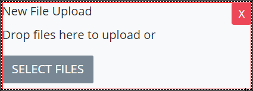

# File Upload Control Settings

## Control Description

The File Upload control adds an area in the ProcessMaker Screen to which the form user can upload one or more files from a local computer. The form user can drag-and-drop the file\(s\) or select a button from which to locate the file\(s\) for upload. The uploaded file\(s\) can be referenced in a later step in the Request.


This control is not available for [Display](../types-for-screens.md#display)-type ProcessMaker Screens. See [Screen Types](../types-for-screens.md).


## Add the Control to a ProcessMaker Screen 

Follow these steps to add this control to the ProcessMaker Screen:

1. View the ProcessMaker Screen page to which to add the control.
2. Go to the **Controls** panel on the left side of the ProcessMaker Screen.
3. Drag the **File Upload** iconfrom the **Controls** panel anywhere within the ProcessMaker Screen canvas represented by the dotted-lined box. Existing controls on the ProcessMaker Screen canvas adjust positioning based on where you drag the control.
4. Drop into the ProcessMaker Screen where you want the control to display on the page.  

   

Below is a File Upload control in Preview mode.

## Inspector Settings 


See [View the Inspector Panel](../view-the-inspector-pane.md) for information how to view the **Inspector** panel.


Below are Inspector settings for the File Upload control:

* **Text Label:** Specify the field label text that displays. **New File Upload** is the default value.
* **Upload Name:** Specify the unique name associated with the uploaded file\(s\). This name can be referenced in a later step in the Request. This setting has no default value.

## Related Topics 







