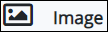
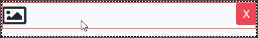

# Image Control Settings

## Control Description

The Image control displays an image.

## Add the Control to a ProcessMaker Screen


Your user account or group membership must have the following permissions to add a control to a ProcessMaker Screen:

* Screens: View Screens
* Screens: Edit Screens

See the ProcessMaker [Screens](../../../../processmaker-administration/permission-descriptions-for-users-and-groups.md#screens) permissions or ask your ProcessMaker Administrator for assistance.


Follow these steps to add this control to the ProcessMaker Screen:

1. [Create](../../manage-forms/create-a-new-form.md) or [open](../../manage-forms/view-all-forms.md) the ProcessMaker Screen. The ProcessMaker Screen is in [Editor mode](../screens-builder-modes.md#editor-mode).
2. View the ProcessMaker Screen page to which to add the control.
3. Go to the **Controls** panel on the left side of the ProcessMaker Screen.
4. Drag the **Image** iconfrom the **Controls** panel anywhere within the ProcessMaker Screen canvas represented by the dotted-lined box. Existing controls on the ProcessMaker Screen canvas adjust positioning based on where you drag the control.
5. Drop into the ProcessMaker Screen where you want the control to display on the page.  

   

6. Configure the Image control. See [Inspector Settings](image-control-settings.md#inspector-settings).

Below is an Image control in Preview mode.

## Inspector Settings


### Don't Know What the Inspector Panel Is?

See [View the Inspector Panel](../view-the-inspector-pane.md).

### Permissions Required to View Control Settings

Your user account or group membership must have the following permissions to edit a ProcessMaker Screen control:

* Screens: View Screens
* Screens: Edit Screens

See the ProcessMaker [Screens](../../../../processmaker-administration/permission-descriptions-for-users-and-groups.md#screens) permissions or ask your ProcessMaker Administrator for assistance.


Below are Inspector settings for the Image control:

* **Id:** Specify the unique internal image identification. ~~This is a required setting.~~
* **Field Name:** Specify the unique internal data name of the control that only the Process Owner views at design time. This setting automatically uses the file name of the uploaded image as its value. This is a required setting. Use the **Field Name** value for this control to reference it in **Show If** setting expressions.
* **Upload Image:** Click the **Upload Image** button to browse for the image to upload to the Image control.
* **Preview:** This setting displays a preview of the uploaded image.
* **Width:** Specify the width of the uploaded image in pixels. If the **Height** setting has no value, the Image control adjust the uploaded image to the **Width** setting value.
* **Height:** Specify the width of the uploaded image in pixels. If the **Width** setting has no value, the Image control adjust the uploaded image to the **Height** setting value.
* **Show If:** Specify an expression that dictates the condition\(s\) under which the Image control displays. See [Expression Syntax Components for "Show If" Control Settings](expression-syntax-components-for-show-if-control-settings.md#expression-syntax-components-for-show-if-control-settings). If this setting does not have an expression, then this control displays by default.

## Related Topics 



































