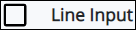
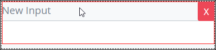

# Line Input Control Settings

## Control Description

The Line Input control adds a text box that the form user can enter plain text or a password.

## Add the Control to a ProcessMaker Screen

Follow these steps to add this control to the ProcessMaker Screen:

1. View the ProcessMaker Screen page to which to add the control.
2. Go to the **Controls** panel on the left side of the ProcessMaker Screen.
3. Drag the **Line Input** icon  from the **Controls** panel to the ProcessMaker Screen page.
4. Drop into the ProcessMaker Screen where you want the control to display on the page.  

   

## Inspector Settings


For information how to view the **Inspector** panel, see [View the Inspector Panel](../view-the-inspector-pane.md).


Below are Inspector settings for the Line Input control:

* **Field Name:** Specify the internal name of the control that only the Process Owner views in design time. This is a required setting.
* **Field Type:** Select one of the following options:
  * **Text:** The form user enters a single line of plain text into the Line Input control. If the entered text is longer than the field width, the form user's text is clipped.
  * **Password:** The form user enters a password into the Line Input control. Entered text is masked. If the entered text is longer than the field width, the form user's text is clipped.
* **Field Label:** Specify the field label text.
* **Validation:** Specify the validation rules the form user must comply with to properly enter a valid value into this field.
* **Placeholder:** Specify the placeholder text that displays in the field when no value has been provided.
* **Help Text:** Specify text that provides additional guidance on the field's use.

## Related Topics





