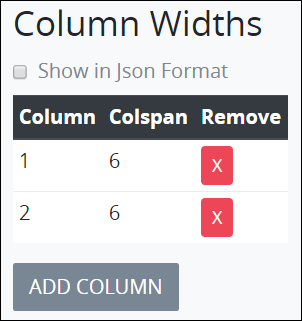

# Multi Column Control Settings

## Control Description 

The Multi Column control adds a layout element with two columns. The Process Owner drops elements into either column.

## Add the Control to a ProcessMaker Screen 


Your user account or group membership must have the following permissions to add a control to a ProcessMaker Screen:

* Screens: View Screens
* Screens: Edit Screens

See the ProcessMaker [Screens](../../../../processmaker-administration/permission-descriptions-for-users-and-groups.md#screens) permissions or ask your ProcessMaker Administrator for assistance.


Follow these steps to add this control to the ProcessMaker Screen:

1. [Create](../../manage-forms/create-a-new-form.md) or [open](../../manage-forms/view-all-forms.md) the ProcessMaker Screen. The ProcessMaker Screen is in [Editor mode](../screens-builder-modes.md#editor-mode).
2. View the ProcessMaker Screen page to which to add the control.
3. Go to the **Controls** panel on the left side of the ProcessMaker Screen.
4. Drag the **Multi Column Button** iconfrom the **Controls** panel anywhere within the ProcessMaker Screen canvas represented by the dotted-lined box. Existing controls on the ProcessMaker Screen canvas adjust positioning based on where you drag the control.
5. Configure the Multi Column control. See [Inspector Settings](multi-column-button-control-settings.md#inspector-settings).
6. Drop into the ProcessMaker Screen where you want the control to display on the page.​
7. Drag-and-drop others controls into either column. Configure each control's settings. 

Below is a Multi Column control in Preview mode. 

## Inspector Settings 


### Don't Know What the Inspector Panel Is?

See [View the Inspector Panel](../view-the-inspector-pane.md).

### Permissions Required to View Control Settings

Your user account or group membership must have the following permissions to edit a ProcessMaker Screen control:

* Screens: View Screens
* Screens: Edit Screens

See the ProcessMaker [Screens](../../../../processmaker-administration/permission-descriptions-for-users-and-groups.md#screens) permissions or ask your ProcessMaker Administrator for assistance.


Below are Inspector settings for the Multi Column control:

* **Field Name:** Specify the unique internal data name of the control that only the Process Owner views at design time. This is a required setting. Use the **Field Name** value for this control to reference it in **Show If** setting expressions.
* **Column Widths:** Specify the column width for each column in the control. Add each column and its width specification in the order they are to display from left to right in the control. Specify the width of each column in `colspan` [HTML attribute](https://www.w3schools.com/tags/att_colspan.asp) settings. The total of all `colspan` attribute settings must be divisible by 12. The control contains two columns of six \(6\) `colspan` HTML attribute setting each by default.  

  

  Each option has the following settings:

  * **Column:** **Column** is the internal designation for the column that only the Process Owner views at design time.
  * **Colspan:** **Colspan** is the width of the column in `colspan` HTML attribute settings. 
  * **Actions:** Click the Removeicon to remove the column.

  Follow these steps to add a column: 

  1. Click **Add Column** from below the **Options Widths** setting. The **Add New Column** screen displays.  

     

  2. In the **Column Width** field, enter the width of the column \(as described above\).
  3. Click **OK**. The column displays below the existing columns in **Column Widths**.

* **Background Color:** Select to specify the background color of the Submit Button control. Selecting a background color also selects the **Background Color** checkbox.
* **Text Color:** Select to specify the text color that displays in the control. Selecting a text color also selects the **Text Color** checkbox.
* **Show If:** Specify an expression that dictates the condition\(s\) under which the Submit Button control displays. See [Expression Syntax Components for "Show If" Control Settings](expression-syntax-components-for-show-if-control-settings.md#expression-syntax-components-for-show-if-control-settings). If this setting does not have an expression, then this control displays by default.

## Related Topics 

































