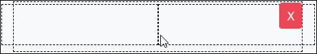

# Multi Column Button Control Settings

## Control Description 

The Multi Column button control adds a layout element with two columns. You can then drop in elements into either column.

## Add the Control to a ProcessMaker Screen 

Follow these steps to add this control to the ProcessMaker Screen:

1. View the ProcessMaker Screen page to which to add the control.
2. Go to the **Controls** panel on the left side of the ProcessMaker Screen.
3. Drag the **Multi Column Button** icon  from the **Controls** panel to the ProcessMaker Screen page.
4. Drop into the ProcessMaker Screen where you want the control to display on the page.​
5. Add others controls into either column. 

Below is a Multi Control button control in Preview mode. 

## Related Topics 





