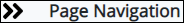
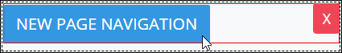

# Page Navigation Button Control Settings

## Control Description 

The Page Navigation Button control adds a button from which the form user can go to another page in a multi-page ProcessMaker Screen. 


This control is not available for [Display](../types-for-screens.md#display)-type ProcessMaker Screens. See [Screen Types](../types-for-screens.md).


## Add the Control to a ProcessMaker Screen 


Your user account or group membership must have the following permissions to add a control to a ProcessMaker Screen:

* Screens: View Screens
* Screens: Edit Screens

See the ProcessMaker [Screens](../../../../processmaker-administration/permission-descriptions-for-users-and-groups.md#screens) permissions or ask your ProcessMaker Administrator for assistance.


Follow these steps to add this control to the ProcessMaker Screen:

1. [Create](../../manage-forms/create-a-new-form.md) or [open](../../manage-forms/view-all-forms.md) the ProcessMaker Screen. The ProcessMaker Screen is in [Editor mode](../screens-builder-modes.md#editor-mode).
2. View the ProcessMaker Screen page to which to add the control.
3. Go to the **Controls** panel on the left side of the ProcessMaker Screen.
4. Drag the **Page Navigation Button** iconfrom the **Controls** panel anywhere within the ProcessMaker Screen canvas represented by the dotted-lined box. Existing controls on the ProcessMaker Screen canvas adjust positioning based on where you drag the control.
5. Drop into the ProcessMaker Screen where you want the control to display on the page.  

   

6. Configure the Page Navigation Button control. See [Inspector Settings](page-navigation-button-control-settings.md#inspector-settings).

Below is a Page Navigation Button control in Preview mode.

## Inspector Settings 


### Don't Know What the Inspector Panel Is?

See [View the Inspector Panel](../view-the-inspector-pane.md).

### Permissions Required to View Control Settings

Your user account or group membership must have the following permissions to edit a ProcessMaker Screen control:

* Screens: View Screens
* Screens: Edit Screens

See the ProcessMaker [Screens](../../../../processmaker-administration/permission-descriptions-for-users-and-groups.md#screens) permissions or ask your ProcessMaker Administrator for assistance.


Below are Inspector settings for the Page Navigation Button control:

* ~~**Field Name:** Specify the unique internal data name of the control that only the Process Owner views at design time. This is a required setting. Use the **Field Name** value for this control to reference it in **Show If** setting expressions.~~
* **Field Label:** Specify the field label text that displays. **New** **Page Navigation** is the default value.
* **Variant:** Specify the style for the Page Navigation Button control. The style changes the control's appearance but otherwise has no functional difference. Select from the following options:
  * **Primary:** Blue-colored background with white-colored **Field Label** text. Set as the default.
  * **Secondary:** Gray-colored background with white-colored **Field Label** text.
  * **Success:** Green-colored background with white-colored **Field Label** text.
  * **Danger:** Red-colored background with white-colored **Field Label** text.
  * **Warning:** Yellow-colored background with black-colored **Field Label** text.
  * **Info:** Teal-colored background with white-colored **Field Label** text.
  * **Light:** White-colored background with black-colored **Field Label** text.
  * **Dark:** Black-colored background with white-colored **Field Label** text.
  * **Link:** White-colored background with blue-colored **Field Label** text.
* **Destination:** Select the destination page to which to navigate in a multi-page ProcessMaker Screen. The default is the first page of the ProcessMaker Screen.
* ~~**Background Color:** Select to specify the background color of the Page Navigation Button control. Selecting a background color also selects the **Background Color** checkbox.~~
* ~~**Text Color:** Select to specify the text color that displays in the control. Selecting a text color also selects the **Text Color** checkbox.~~
* **Show If:** Specify an expression that dictates the condition\(s\) under which the Page Navigation Button control displays. See [Expression Syntax Components for "Show If" Control Settings](expression-syntax-components-for-show-if-control-settings.md#expression-syntax-components-for-show-if-control-settings). If this setting does not have an expression, then this control displays by default.

## Related Topics 



































