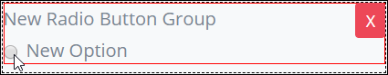
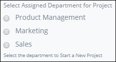

# Radio Group Control Settings

## Control Description

The Radio Group control provides a set of options from which the user can only select one.

## Add the Control to a ProcessMaker Screen

Follow these steps to add this control to the ProcessMaker Screen:

1. View the ProcessMaker Screen page to which to add the control.
2. Go to the **Controls** panel on the left side of the ProcessMaker Screen.
3. Drag the **Radio Group** icon  from the **Controls** panel to the ProcessMaker Screen page.
4. Drop into the ProcessMaker Screen where you want the control to display on the page.  

   

Below is a Radio Group control in Preview mode.

## Inspector Settings 


For information how to view the **Inspector** panel, see [View the Inspector Panel](../view-the-inspector-pane.md).


Below are Inspector settings for the Radio Group control:

* **Field Label:** Specify the field label text displayed to the form user. Set by default as **New Radio Button Group**.
* **Help Text:** Specify text that provides additional guidance on the field's use.
* **Option List:** Specify the list of options available in the radio group. Each option has the following settings:

  * **Value:** **Value** is the internal data name for the option that only the Process Owner views at design time.
  * **Content:** **Content** is the option label displayed to the form user.
  * **Actions:** Click the Remove  icon to remove the option.

    A default option is called **new** with the content **New Option**.

  Follow these steps to add an option:

  1. Click **Add Option** from below the **Options List** setting. The **Add New Option** screen displays.

     ​​

  2. Enter in the **Option Value** field the **Value** option value \(as described above\).
  3. Enter in the **Option Label** field the **Content** option value \(as described above\).
  4. Click **OK**. Otherwise, click **Cancel** to not add a new option.

## Related Topics 





