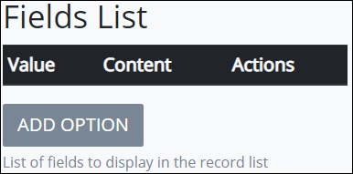

# Record List Control Settings

## Control Description 

The Record List control allows the form user to add several values in a list.

## Add the Control to a ProcessMaker Screen 


Your user account or group membership must have the following permissions to add a control to a ProcessMaker Screen:

* Screens: View Screens
* Screens: Edit Screens

See the ProcessMaker [Screens](../../../../processmaker-administration/permission-descriptions-for-users-and-groups.md#screens) permissions or ask your ProcessMaker Administrator for assistance.


Follow these steps to add this control to the ProcessMaker Screen:

1. [Create](../../manage-forms/create-a-new-form.md) or [open](../../manage-forms/view-all-forms.md) the ProcessMaker Screen. The ProcessMaker Screen is in [Editor mode](../screens-builder-modes.md#editor-mode).
2. View the ProcessMaker Screen page to which to add the control.
3. Go to the **Controls** panel on the left side of the ProcessMaker Screen.
4. Drag the **Record List** iconfrom the **Controls** panel anywhere within the ProcessMaker Screen canvas represented by the dotted-lined box. Existing controls on the ProcessMaker Screen canvas adjust positioning based on where you drag the control.
5. Drop into the ProcessMaker Screen where you want the control to display on the page.

   

~~I don't understand how to make a Record List Control display in Preview mode.~~

## Inspector Settings 


### Don't Know What the Inspector Panel Is?

See [View the Inspector Panel](../view-the-inspector-pane.md).

### Permissions Required to View Control Settings

Your user account or group membership must have the following permissions to edit a ProcessMaker Screen control:

* Screens: View Screens
* Screens: Edit Screens

See the ProcessMaker [Screens](../../../../processmaker-administration/permission-descriptions-for-users-and-groups.md#screens) permissions or ask your ProcessMaker Administrator for assistance.


Below are Inspector settings for the Record List control:

* **List Name:** Specify the internal data name of the control that only the Process Owner views at design time. This is a required setting.
* **List Label:** Specify the field label text that displays. **New Record List** is the default value.
* **Editable?:** Select to indicate that records in the list can be added upon, edited, or removed. Otherwise, deselect to indicate that records in the list cannot be changed. This setting is not selected by default.

  Note that if the **Editable?** setting is selected and the **Record Form** option is set to the same page that the Record List control displays, the following message displays in Preview mode: **The add/edit form referencing our own form is not allowed**. Set the **Record Form** option to a different page than the one the Record List control displays.

* **Fields List:** Specify the list of options available in the Record List.  

  

  Each option has the following settings:

  * **Value:** **Value** is the internal data name for the option that only the Process Owner views at design time.
  * **Content:** **Content** is the option label displayed to the form user.
  * **Actions:** Click the Removeicon to remove the field item.

  Follow these steps to add an option:

  1. Click **Add Option** from below the **Fields List** setting. The **Add New Option** screen displays.

     ​​

  2. In the **Option Value** field, enter the **Value** option value \(as described above\).
  3. In the **Option Label** field, enter the **Content** option value \(as described above\).
  4. Click **OK**. The field item displays below the existing items in **Fields List**.

* **Record Form:** Select from which page in the ProcessMaker Screen to add/edit records. The default is the first page of the ProcessMaker Screen.

## Related Topics 































