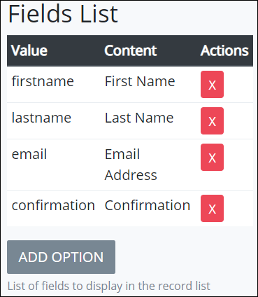
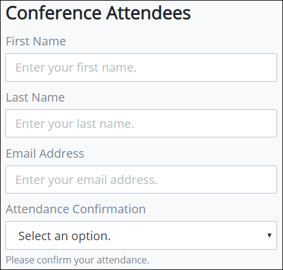

# Record List Control Settings

## Control Description 

The Record List control records values that the form user enters into another page of the ProcessMaker Screen. Optionally, values can be edited after the form user initially enters the record\(s\) into the secondary ProcessMaker Screen page.

The page that records the submitted records cannot be on the same page as the Record List control.

## Add the Control to a ProcessMaker Screen 


Your user account or group membership must have the following permissions to add a control to a ProcessMaker Screen:

* Screens: View Screens
* Screens: Edit Screens

See the ProcessMaker [Screens](../../../../processmaker-administration/permission-descriptions-for-users-and-groups.md#screens) permissions or ask your ProcessMaker Administrator for assistance.


Follow these steps to add this control to the ProcessMaker Screen:

1. [Create](../../manage-forms/create-a-new-form.md) or [open](../../manage-forms/view-all-forms.md) the ProcessMaker Screen. The ProcessMaker Screen is in [Editor mode](../screens-builder-modes.md#editor-mode).
2. View the ProcessMaker Screen page to which to add the control.
3. Go to the **Controls** panel on the left side of the ProcessMaker Screen.
4. Drag the **Record List** iconfrom the **Controls** panel anywhere within the ProcessMaker Screen canvas represented by the dotted-lined box. Existing controls on the ProcessMaker Screen canvas adjust positioning based on where you drag the control.
5. Place into the ProcessMaker Screen canvas where you want the control to display on the page.

   

6. Configure the Record List control. See [Inspector Settings](record-list-control-settings.md#inspector-settings).
7. Create a new page in the ProcessMaker Screen. The page that records the submitted records cannot be on the same page as the Record List control. See [Add a New Page to a ProcessMaker Screen](../add-a-new-page-to-a-screen.md#add-a-new-page-to-a-processmaker-screen).
8. On the new page, create the form using controls to record the data that the Record List control records. In each of the controls to record elements of the record list, ensure to use the same **Field Name** value as you use in the Record List control's **Value** parameter. These values must match for the Record List control to correspond with each control in the secondary ProcessMaker Screen page.

## Example

Consider the following example. A Record List control can be configured to record the following data about each attendee to a conference.

| Record List Value | Record List Content |
| :--- | :--- |
| firstname | First name of attendee |
| lastname | Last name of attendee |
| email | Email address of attendee |
| confirmation | Confirmation from the attendee |

The Record List control has the following configuration. See [Inspector Settings](record-list-control-settings.md#inspector-settings) for control setting descriptions.

On a secondary page, use ProcessMaker Screen controls for form users to enter values for each record. Ensure the following:

* The Record List control references the secondary page to record each record from each conference attendee. The page that records the submitted records cannot be on the same page as the Record List control. 
* In each of the controls to record elements of the record list, ensure to use the same **Field Name** value as you use in the Record List control's **Value** parameter. These values must match for the Record List control to correspond with each control in the secondary ProcessMaker Screen page.

Below is the secondary ProcessMaker Screen page in Preview mode for each conference attendee to enter a record.

| Control Type | "Field Name" Value for Control | Corresponds to Record List Value |
| :--- | :--- | :--- |
| Line Input | firstname | First name of attendee |
| Line Input | lastname | Last name of attendee |
| Line Input | email | Email address of attendee |
| Select | confirmation | Confirmation from the attendee |

## Delete the Control from a ProcessMaker Screen


Deleting a control also deletes configuration for that control. If you add another control, it will have default settings.


Click the **Delete** iconfor the control to delete it.

## Inspector Settings 


### Don't Know What the Inspector Panel Is?

See [View the Inspector Panel](../view-the-inspector-pane.md).

### Permissions Required

Your user account or group membership must have the following permissions to edit a ProcessMaker Screen control:

* Screens: View Screens
* Screens: Edit Screens

See the ProcessMaker [Screens](../../../../processmaker-administration/permission-descriptions-for-users-and-groups.md#screens) permissions or ask your ProcessMaker Administrator for assistance.


Below are Inspector settings for the Record List control:

* **List Name:** Specify the unique internal data name of the control that only the Process Owner views at design time. This is a required setting. Use the **List Name** value for this control to reference it in [**Show If** setting expressions](expression-syntax-components-for-show-if-control-settings.md).
* **List Label:** Specify the field label text that displays. **New Record List** is the default value.
* **Editable?:** Select to indicate that the record that the form user enters can be edited. Otherwise, deselect to indicate that the form user's record cannot be changed. This setting is not selected by default.
* **Fields List:** Specify the list of options the Record List records from the form user. Each option in the **Fields List** setting references a control on a secondary ProcessMaker Screen page that uses the same **Field Name** value as entered into the **Value** parameter. These values must match for the Record List control to correspond with each control in the secondary ProcessMaker Screen page. See the [example](record-list-control-settings.md#example). The following message displays in Preview mode when not all the **Value** parameters match with a control's **Field Name** value on the secondary page: **There is no records in this list or the data is invalid.**   

  

  Each option has the following settings:

  * **Value:** **Value** is the internal data name for the option that only the Process Owner views at design time. Make note of each **Value** parameter you enter here, and then ensure to use the same **Field Name** value for the corresponding control in the secondary page to record that field's value for the record. These values must match for the Record List control to correspond with each control in the secondary ProcessMaker Screen page.
  * **Content:** **Content** is the option label to indicate what content the target control on the secondary ProcessMaker Screen page records. The Process Owner views this at design time and does not display to the form user.
  * **Actions:** Click the **Remove**icon to remove the field item.

  Follow these steps to add an option:

  1. Click **Add Option** from below the **Fields List** setting. The **Add New Option** screen displays.

     ​​

  2. In the **Option Value** field, enter the **Value** option value \(as described above\).
  3. In the **Option Label** field, enter the **Content** option value \(as described above\).
  4. Click **OK**. The field item displays below the existing items in **Fields List**.

* **Record Form:** Select from which ProcessMaker Screen page to add/edit records. The page that records the submitted records cannot be on the same page as the Record List control. The following message displays in Preview mode when the Record List control references the same page the control is placed: **The add/edit form referencing our own form which is not allowed.**

## Related Topics 



































