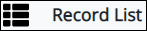
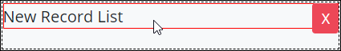

# Record List Control Settings

Add a Record List control from which the form user can insert several values in a list. \(\*\*\*revision\*\*\*\*\)

## Control Description 

The Record List control adds the values to a list of the ProcessMaker Screen.\(\*\*\*revision\*\*\*\*\)

## Add the Control to a ProcessMaker Screen 

Follow these steps to add this control to the ProcessMaker Screen:

1. View the ProcessMaker Screen page to which to add the control.
2. Go to the **Controls** panel on the left side of the ProcessMaker Screen.
3. Drag the **Record List** icon  from the **Controls** panel to the ProcessMaker Screen page.
4. Drop into the ProcessMaker Screen where you want the control to display on the page.

   ​  ​

   

## Inspector Settings 


For information how to view the **Inspector** panel, see [View the Inspector Panel](https://processmaker.gitbook.io/processmaker-4-community/-LPblkrcFWowWJ6HZdhC/designing-processes/design-forms/screens-builder/view-the-inspector-pane).


Below are Inspector settings for the Record List control:

* **List Name:** Specify the data name for this list
* **List Label:** Specify the label describes this record list. Set by default as 

  **New Record List.**

  * **Editable?:** Should records be editable/removable and can new records be added.

* **Record Form:** The form to use for adding/editing records.

## Related Topics 





