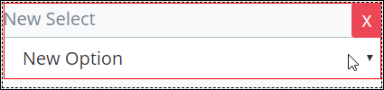
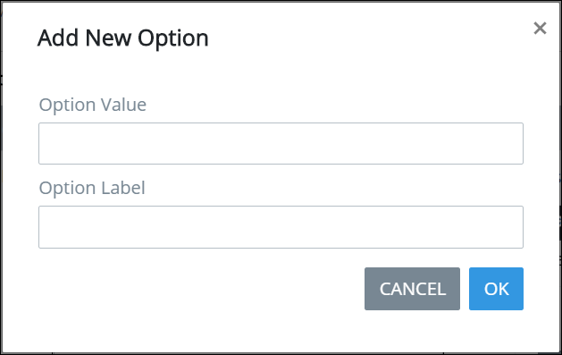

# Select Control Settings

## Control Description

The Select control provides a drop-down menu from which the form user selects a single option.

##  Add the Control to a ProcessMaker Screen

Follow these steps to add this control to the ProcessMaker Screen:

1. View the ProcessMaker Screen page to which to add the control.
2. Go to the **Controls** panel on the left side of the ProcessMaker Screen.
3. Drag the **Select** icon  from the **Controls** panel to the ProcessMaker Screen page.
4. Drop into the ProcessMaker Screen where you want the control to display on the page.  

   

## Inspector Settings 


For information how to view the **Inspector** panel, see [View the Inspector Panel](https://processmaker.gitbook.io/processmaker-4-community/-LPblkrcFWowWJ6HZdhC/designing-processes/design-forms/screens-builder/view-the-inspector-pane).


Below are Inspector settings for the Line Input control:

* **Field Name:** Specify the internal data name of the control that only the Process Owner views at design time.
* **Field Label:** Specify the field label text displayed to the form user. Set by default as **New Select**.
* **Validation:** Specify the validation rules the form user must comply with to properly enter a valid value into this field.
* **Help Text:**  Specify text that provides additional guidance on the field's use.
* **Option List:** Specify the list of options available in the select boxes. Options must be added in the order they are to display from top to bottom. Each option has the following settings:

  * **Value:** **Value** is the internal data name for the option that only the Process Owner views at design time.
  * **Content:** **Content** is the option label displayed to the form user. 
  * **Actions:** Click the Remove  icon to remove the option.

    A default option is called **new** with the content **New Option**.

  Follow these steps to add an option: 

  1. Click **Add Option** from below the **Option List** setting. The **Add New Option** screen displays.  

     

  2. Enter in the **Option Value** field the **Value** option value \(as described above\).
  3. Enter in the **Option Label** field the **Content** option value \(as described above\).
  4. Click **OK**. Otherwise, click **Cancel** to not add a new option.

​

## Related Topics





