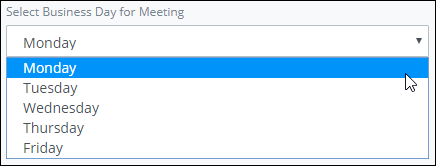

# Select Control Settings

## Control Description

The Select control provides a drop-down menu from which the form user selects a single option.


This control is not available for [Display](../types-for-screens.md#display)-type ProcessMaker Screens. See [Screen Types](../types-for-screens.md).


## Add the Control to a ProcessMaker Screen


Your user account or group membership must have the following permissions to add a control to a ProcessMaker Screen:

* Screens: View Screens
* Screens: Edit Screens

See the ProcessMaker [Screens](../../../../processmaker-administration/permission-descriptions-for-users-and-groups.md#screens) permissions or ask your ProcessMaker Administrator for assistance.


Follow these steps to add this control to the ProcessMaker Screen:

1. [Create](../../manage-forms/create-a-new-form.md) or [open](../../manage-forms/view-all-forms.md) the ProcessMaker Screen. The ProcessMaker Screen is in [Editor mode](../screens-builder-modes.md#editor-mode).
2. View the ProcessMaker Screen page to which to add the control.
3. Go to the **Controls** panel on the left side of the ProcessMaker Screen.
4. Drag the **Select** icon  from the **Controls** panel anywhere within the ProcessMaker Screen canvas represented by the dotted-lined box. Existing controls on the ProcessMaker Screen canvas adjust positioning based on where you drag the control.
5. Drop into the ProcessMaker Screen where you want the control to display on the page.  

   

Below is a Select control in Preview mode.

## Inspector Settings 


### Don't Know What the Inspector Panel Is?

See [View the Inspector Panel](../view-the-inspector-pane.md).

### Permissions Required to View Control Settings

Your user account or group membership must have the following permissions to edit a ProcessMaker Screen control:

* Screens: View Screens
* Screens: Edit Screens

See the ProcessMaker [Screens](../../../../processmaker-administration/permission-descriptions-for-users-and-groups.md#screens) permissions or ask your ProcessMaker Administrator for assistance.


Below are Inspector settings for the Line Input control:

* **Field Name:** Specify the internal data name of the control that only the Process Owner views at design time. This is a required setting.
* **Field Label:** Specify the field label text that displays. **New Select** is the default value.
* **Validation:** Specify the validation rules the form user must comply with to properly enter a valid value into this field. This setting has no default value.
* **Help Text:** Specify text that provides additional guidance on the field's use. This setting has no default value.
* **Options List:** Specify the list of options available in the select box. Add options in the order they are to display from top to bottom in the drop-down. The default option is called **new** with the content **New Option**.  

  

  Each option has the following settings:

  * **Value:** **Value** is the internal data name for the option that only the Process Owner views at design time.
  * **Content:** **Content** is the option label displayed to the form user. 
  * **Actions:** Click the Removeicon to remove the option.

  Follow these steps to add an option: 

  1. Click **Add Option** from below the **Options List** setting. The **Add New Option** screen displays.  

     

  2. In the **Option Value** field, enter the **Value** option value \(as described above\).
  3. In the **Option Label** field, enter the **Content** option value \(as described above\).
  4. Click **OK**. The option displays below the existing options in **Options List**.

* **Background Color:** Select to specify the background color of the Select control. Selecting a background color also selects the **Background Color** checkbox.
* **Text Color:** Select to specify the text color that displays in the control. Selecting a text color also selects the **Text Color** checkbox.
* **Show If:** Specify an expression that dictates the condition\(s\) under which the Select control displays. See [Expression Syntax Components for "Show If" Control Settings](expression-syntax-components-for-show-if-control-settings.md#expression-syntax-components-for-show-if-control-settings). If this setting does not have an expression, then this control displays by default.

## ​Related Topics

































