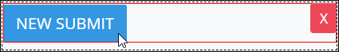

# Submit Button Control Settings

## Control Description

The Submit Button control adds a button from which the form user can submit the form as part of a Request. After using the Submit Button control, the form user cannot revise that form because the information included in the ProcessMaker Screen is sent to the next task in the Request.

## Add the Control to a ProcessMaker Screen 

Follow these steps to add this control to the ProcessMaker Screen:

1. View the ProcessMaker Screen page to which to add the control.
2. Go to the **Controls** panel on the left side of the ProcessMaker Screen.
3. Drag the **Submit Button** icon  from the **Controls** panel to the ProcessMaker Screen page.
4. Drop into the ProcessMaker Screen where you want the control to display on the page.  

   

Below is a Submit Button control in Preview mode.

## Inspector Settings 


For information how to view the **Inspector** panel, see [View the Inspector Panel](https://processmaker.gitbook.io/processmaker-4-community/-LPblkrcFWowWJ6HZdhC/designing-processes/design-forms/screens-builder/view-the-inspector-pane).


Below are Inspector settings for the Submit Button control:

* **Field Label:** Specify the field label text displayed to the form user. Set by default as **New Submit**.
* **Variant:** Specify the style for the Submit Button control. The style changes the control's appearance but otherwise has no functional difference. Select from the following options:
  * **Primary:** Blue-colored background with white-colored **Field Label** text. Set as the default.
  * **Secondary:** Gray-colored background with white-colored **Field Label** text.
  * **Success:** Green-colored background with white-colored **Field Label** text.
  * **Danger:** Red-colored background with white-colored **Field Label** text.
  * **Warning:** Yellow-colored background with black-colored **Field Label** text.
  * **Info:** Teal-colored background with white-colored **Field Label** text.
  * **Light:** White-colored background with black-colored **Field Label** text.
  * **Dark:** Black-colored background with white-colored **Field Label** text.
  * **Link:** White-colored background with blue-colored **Field Label** text.

## Related Topics 





