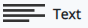
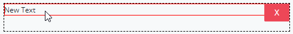

# Text Control Settings

## Control Description

The Text control adds a text box field where you can enter or paste text.

## Add the Control to a ProcessMaker Screen

Follow these steps to add this control to the ProcessMaker Screen:

1. View the ProcessMaker Screen page to which to add the control.
2. Go to the **Controls** panel on the left side of the ProcessMaker Screen.
3. Drag the **Text** icon from the **Controls** panel to the ProcessMaker Screen page. 

   

4. Drop into the ProcessMaker Screen where you want the control to display on the page.  

   

## Inspector Settings


For information how to view the **Inspector** pane, see [View the Inspector Pane](../view-the-inspector-pane.md).


These are Inspector settings for the Text control:

* **Text Label:** Set by default as "New Text". You can change the name.
* **Font Weight:** Set by default as "Normal". You can change to "Bold".
* **Font Size:** Set by default as "1". You can change the size between 0.5, 1, 1.5 and 2.

