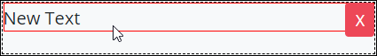
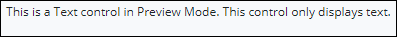

# Text Box Settings

## Control Description

The Text Box control adds a text field that displays text.

## Add the Control to a ProcessMaker Screen


Your user account or group membership must have the following permissions to add a control to a ProcessMaker Screen:

* Screens: View Screens
* Screens: Edit Screens

See the ProcessMaker [Screens](../../../../processmaker-administration/permission-descriptions-for-users-and-groups.md#screens) permissions or ask your ProcessMaker Administrator for assistance.


Follow these steps to add this control to the ProcessMaker Screen:

1. [Create](../../manage-forms/create-a-new-form.md) or [open](../../manage-forms/view-all-forms.md) the ProcessMaker Screen. The ProcessMaker Screen is in [Editor mode](../screens-builder-modes.md#editor-mode).
2. View the ProcessMaker Screen page to which to add the control.
3. Go to the **Controls** panel on the left side of the ProcessMaker Screen.
4. Drag the **Text Box** icon  from the **Controls** panel anywhere within the ProcessMaker Screen canvas represented by the dotted-lined box. Existing controls on the ProcessMaker Screen canvas adjust positioning based on where you drag the control.
5. Drop into the ProcessMaker Screen where you want the control to display on the page.   

   

Below is a Text Box control in Preview mode.

## Inspector Settings


### Don't Know What the Inspector Panel Is?

See [View the Inspector Panel](../view-the-inspector-pane.md).

### Permissions Required to View Control Settings

Your user account or group membership must have the following permissions to edit a ProcessMaker Screen control:

* Screens: View Screens
* Screens: Edit Screens

See the ProcessMaker [Screens](../../../../processmaker-administration/permission-descriptions-for-users-and-groups.md#screens) permissions or ask your ProcessMaker Administrator for assistance.


Below are Inspector settings for the Text Box control:

* **Field Name:** Specify the internal data name of the control that only the Process Owner views at design time. This is a required setting.
* **Text Content:** Specify what text displays for the Text Box control. **New Text** is the default value. You can change what text will display.
* **Font Weight:** Sets the weight of the text specified in the **Text Content** setting. **Normal** is the default option. You can change to **Bold**.
* ~~**Text Color:** Sets the color of the displayed text. Use any HTML or Hex code. This setting has no default value.~~
* **Text Alignment:** Sets the text alignment. **Left** is the default option. Select one of the following options:
  * Center
  * Left
  * Right
  * Justify
* **Font Size:** Sets the size of the **Text Label** text in em units. **1** is the default option. Select one of the following options:
  * 1
  * 1.5
  * 2
* **Background Color:** Select to specify the background color of the Text Box control. Select the **Background Color** checkbox, and then select the background color.
* **Text Color:** Select to specify the text color specified in the **Text Content** setting. Select the **Text Color** checkbox, and then select the text color.
* **CSS ID:** Specify the CSS ID for custom CSS. Reference this CSS ID when specifying style for this control in [Custom CSS](../add-custom-css-to-a-screen.md) mode. By default this setting uses the **Field Name** setting.
* **Show If:** Specify an expression that dictates the condition\(s\) under which the Text Box control displays. See [Expression Syntax Components for "Show If" Control Settings](expression-syntax-components-for-show-if-control-settings.md#expression-syntax-components-for-show-if-control-settings). If this setting does not have an expression, then this control displays by default.


Below are some ways to render Request data to display as text in a Text Box control:

* Use mustache template syntax to reference the Request data. Example: `Customer First Order Name: {{customer.orders.0.name}}`
* Include your own HTML syntax in the Text Box control along with template references. Example: `Customer First Name: <strong>{{customer.firstname}}</strong>`


## Related Topics

































