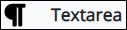
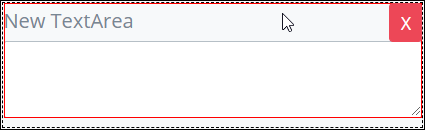

# Textarea Control Settings

## Control Description

Though this control displays a vertical scroll bar if more than three lines are inserted, the input box can be expanded according to the necessity. To do this, simply click on the lower right-hand corner of the input box of the **Textarea** control and without releasing the button of the mouse, enlarge or shrink it until the desired size.

##  Add the Control to a ProcessMaker Screen 

Follow these steps to add this control to the ProcessMaker Screen:

1. View the ProcessMaker Screen page to which to add the control.
2. Go to the **Controls** panel on the left side of the ProcessMaker Screen.
3. Drag the **Textarea** icon   from the **Controls** panel to the ProcessMaker Screen page.
4. Drop into the ProcessMaker Screen where you want the control to display on the page.

   ​  ​

## Inspector Settings 


For information how to view the **Inspector** panel, see [View the Inspector Panel](https://processmaker.gitbook.io/processmaker-4-community/-LPblkrcFWowWJ6HZdhC/designing-processes/design-forms/screens-builder/view-the-inspector-pane).


Below are Inspector settings for the Textarea control:

* **Field Name:** Specify the internal data name of the control that only the Process Owner views at design time. It is required.
* **Field Label:** Specify the field label text displayed to the form user. Set by default as **New TextArea**.
* **Validation:** Specify the validation rules the form user must comply with to properly enter a valid value into this field.
* **Rows:** The number of rows to provide for input. Set by default as 2.
* **Placeholder:** The placeholder is what is shown in the field when no value is provided yet.
* **Help Text:** Specify text that provides additional guidance on the field's use.

## Related Topics 





