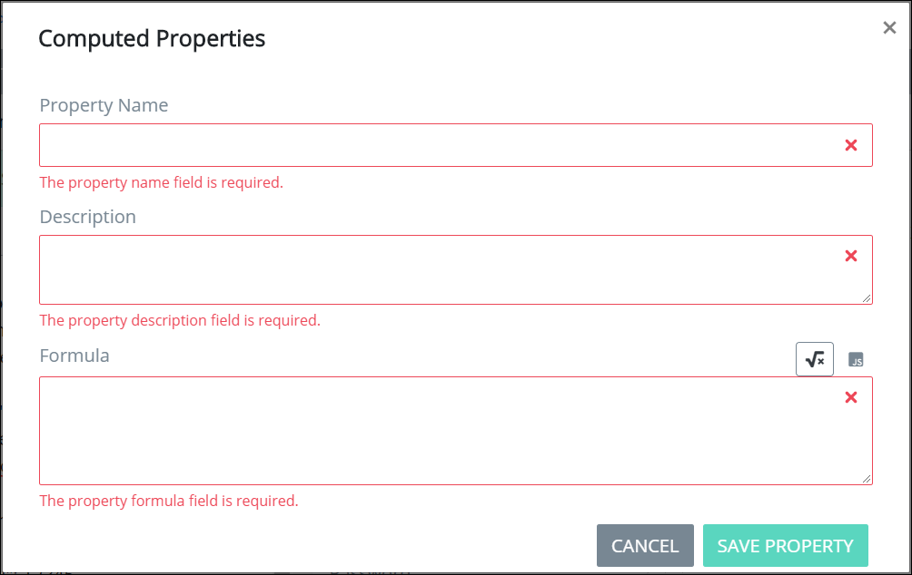

# Manage Computed Properties

## Overview

Use Computed Properties mode to add Properties to a ProcessMaker Screen's JSON data model. A Property represents any value, mathematical calculation, or formula that computes a value. A Property's computation can be determined either through a mathematical formula or valid JavaScript, and may include values from [ProcessMaker Screen control](control-descriptions/) values during a Request. Likewise, a computed Property's value can be displayed in a ProcessMaker Screen control. Computed Properties can only be used within and only affect the currently opened ProcessMaker Screen.

Below are a few uses for computed Properties that can be calculated mathematically or through JavaScript:

* Perform simple mathematics. Example: `1+1`
* Calculate the final cost of a purchase based on a sales tax. Example: $`60` \(item cost\) x `.075` \(sales tax\)
* Calculate the minimum credit card payment. Example: $`1000` \(amount owed\) x `.03` \(interest rate\)

Computed Properties display as the second key-value pair in the JSON data model from the [**Data Preview** panel when previewing the ProcessMaker Screen](preview-a-screen.md).

## Add a Computed Property


Your user account or group membership must have the following permissions to add a computed Property to a ProcessMaker Screen:

* Screens: View Screens
* Screens: Edit Screens

See the ProcessMaker [Screens](../../../processmaker-administration/permission-descriptions-for-users-and-groups.md#screens) permissions or ask your ProcessMaker Administrator for assistance.


Follow these steps to add a computed Property:

1. [Open](../manage-forms/view-all-forms.md) the ProcessMaker Screen in which to add a computed Property. The ProcessMaker Screen is in [Editor mode](screens-builder-modes.md#editor-mode).
2. Click the **Computed Properties** option from Screen Builder's top menu. The **Computed Properties** screen displays to show all Properties configured for this ProcessMaker Screen. All Properties configured in this screen display their computed values in the JSON data model from the [**Data Preview** panel when previewing the ProcessMaker Screen](preview-a-screen.md). If no Properties have been configured for this ProcessMaker Screen, **Property Name** displays as a placeholder for the first Property.  

   

3. Click the **+Add Property** button. The **Computed Properties** screen displays.  

   

4. In the **Property Name** field, enter the name of the Property. This Property name displays both in the **Computer Properties** screen and in the JSON data model when previewing the ProcessMaker Screen. This is a required field.
5. In the **Formula \(javascript\)** field, enter the value, mathematical calculation, or formula that computes a value. This value can be computed through valid JavaScript. This is a required field.
6. Click **Save Property**. The Property displays in the **Computed Properties** screen. The following message displays: **Property Saved**.

## View a Computed Property's Details


Your user account or group membership must have the following permissions to view a computed Property's details:

* Screens: View Screens
* Screens: Edit Screens

See the ProcessMaker [Screens](../../../processmaker-administration/permission-descriptions-for-users-and-groups.md#screens) permissions or ask your ProcessMaker Administrator for assistance.


Follow these steps to view a computed Property:

1. [Open](../manage-forms/view-all-forms.md) the ProcessMaker Screen in which to add a computed Property. The ProcessMaker Screen is in [Editor mode](screens-builder-modes.md#editor-mode).
2. [Open the **Computed Properties** screen.](manage-computed-properties.md#add-a-computed-property)
3. Click the **Details** icon. The **Computed Properties** screen displays how the selected Property is named and computed.  

   

4. Click the **Hide Details** button to hide the Property's details.

## Edit a Computed Property


Your user account or group membership must have the following permissions to edit a computed Property:

* Screens: View Screens
* Screens: Edit Screens

See the ProcessMaker [Screens](../../../processmaker-administration/permission-descriptions-for-users-and-groups.md#screens) permissions or ask your ProcessMaker Administrator for assistance.


Follow these steps to edit a computed Property:

1. [Open](../manage-forms/view-all-forms.md) the ProcessMaker Screen in which to add a computed Property. The ProcessMaker Screen is in [Editor mode](screens-builder-modes.md#editor-mode).
2. [Open the **Computed Properties** screen.](manage-computed-properties.md#add-a-computed-property)
3. Click the **Edit** icon. The **Computed Properties** screen displays how the selected Property is named and computed.  

   

4. Edit the following information about the Property as necessary:
   * In the **Property Name** field, enter the name of the Property. This Property name displays both in the **Computer Properties** screen and in the JSON data model when previewing the ProcessMaker Screen.
   * In the **Formula \(javascript\)** field, enter the value, mathematical calculation, or formula that computes a value. This value can be computed through valid JavaScript.
5. Click **Save Property**.

## Delete a Computed Property


Your user account or group membership must have the following permissions to delete a computed Property from a ProcessMaker Screen:

* Screens: View Screens
* Screens: Edit Screens

See the ProcessMaker [Screens](../../../processmaker-administration/permission-descriptions-for-users-and-groups.md#screens) permissions or ask your ProcessMaker Administrator for assistance.


Follow these steps to edit a computed Property:

1. [Open](../manage-forms/view-all-forms.md) the ProcessMaker Screen in which to delete a computed Property. The ProcessMaker Screen is in [Editor mode](screens-builder-modes.md#editor-mode).
2. [Open the **Computed Properties** screen.](manage-computed-properties.md#add-a-computed-property)
3. Click the **Delete** icon. The Property is deleted, and the following message displays: **Property deleted**.

## Related Topics









