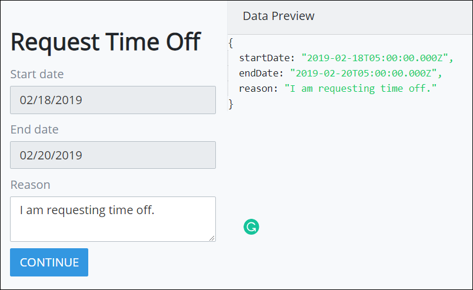
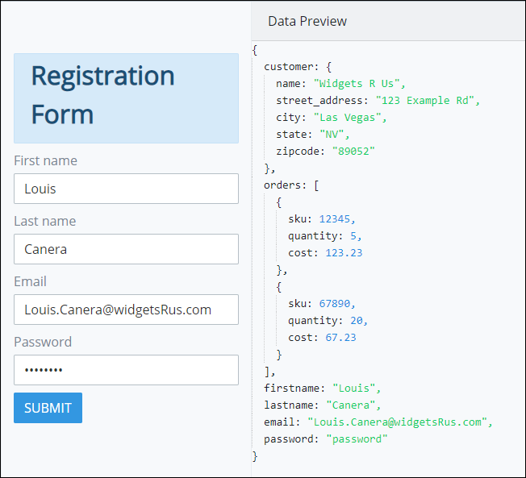

# Preview a Screen and Its JSON Data Model

## Overview

Use Screen Builder's Preview mode to view how your ProcessMaker Screen displays. Furthermore, Preview mode allows you to view how the ProcessMaker Screen's controls you configured in Editor mode contain data in the form of a JSON data model.

The JSON data model displays in the **Data Preview** panel when in Preview mode.

The JSON data model uses key-value pairs: the key names are those you set when you [configured your ProcessMaker Screen controls](control-descriptions/), while the values are those that you entered while previewing the Screen. During an actual Request in a ProcessMaker process, these values would be those entered by a Request participant.

Why is this important? ProcessMaker Developers can use a ProcessMaker Screen's JSON data model as variable input to a ProcessMaker Script.


Are you a ProcessMaker Developer developing ProcessMaker Scripts? See [Scripts Editor](../../scripts/scripts-editor.md) for more information.


## Preview a ProcessMaker Screen and Its JSON Data Model

Follow these guidelines to preview a ProcessMaker Screen and view its JSON data model:

1. [Open the ProcessMaker Screen.](../manage-forms/edit-a-screen.md)
2. Click the **Preview** option from Screen Builder's top menu.
3. Enter values into the control fields as if you were using the ProcessMaker Screen in a Request. In the **Data Preview** panel to the right of the ProcessMaker Screen, the JSON data model displays the key-value pairs. The key's values are those you enter in the ProcessMaker Screen preview.

## Related Topics











