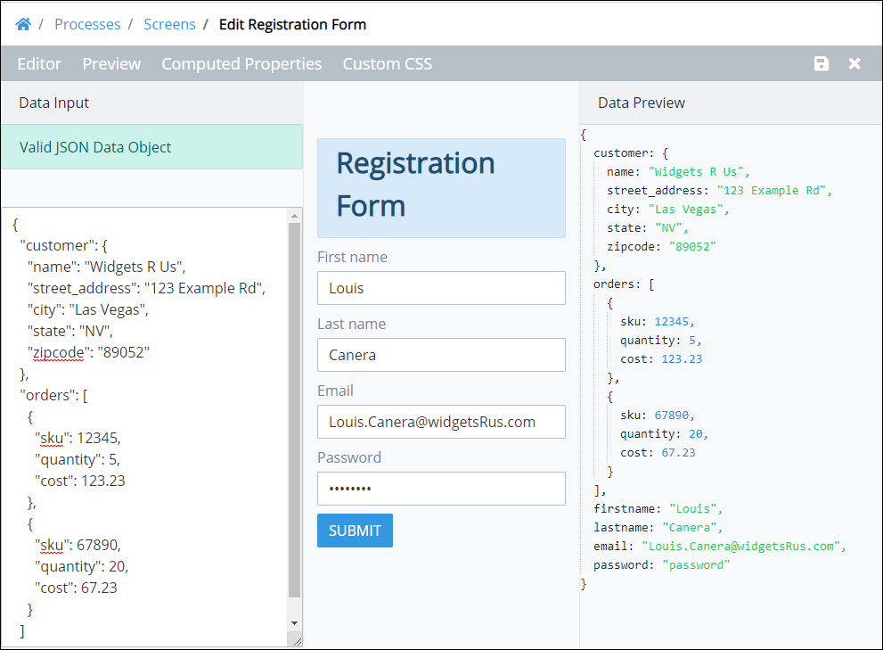

# Preview a Screen and Its JSON Data Model

## Overview

Use [Preview mode](screens-builder-modes.md#preview-mode) to view how the ProcessMaker Screen's controls you configured in [Editor mode](screens-builder-modes.md#editor-mode) use data in a JSON data model. To allow ProcessMaker Screens to be used among any Process, they are represented in JSON format. You can view the JSON data model in Preview mode as you enter information into your previewed ProcessMaker Screen. Viewing the JSON data model can be helpful to see how values are entered into the ProcessMaker Screen.

The JSON data model displays in the **Data Preview** panel when in Preview mode.

The JSON data model uses key-value pairs: the key names are those you set when you [configured your ProcessMaker Screen controls](control-descriptions/), while the values are those that you entered while previewing the ProcessMaker Screen. During an actual Request in a Process, these values would be entered or viewed by a Request participant.

Why is this important? ProcessMaker Developers can use a ProcessMaker Screen's JSON data model as variable input to a ProcessMaker Script. ProcessMaker Screens are independent of Processes. Any ProcessMaker Screen can be used in any Process throughout your organization. The JSON data model within a ProcessMaker Screen becomes the variables used in any Process that uses that Screen. ProcessMaker Developers can use these variables to capture what Request participants enter into a Screen and use this data in a ProcessMaker Script.


Are you a ProcessMaker Developer developing ProcessMaker Scripts? See [Scripts Editor](../../scripts/scripts-editor.md).


## Preview a ProcessMaker Screen and Its JSON Data Model


Your user account or group membership must have the following permissions to preview a ProcessMaker Screen:

* Screens: View Screens
* Screens: Edit Screens

See the ProcessMaker [Screens](../../../processmaker-administration/permission-descriptions-for-users-and-groups.md#screens) permissions or ask your ProcessMaker Administrator for assistance.


Follow these guidelines to preview a ProcessMaker Screen and view its JSON data model:

1. [Open](../manage-forms/view-all-forms.md) the ProcessMaker Screen.
2. Click the **Preview** option from Screen Builder's top menu.
3. Enter values into the control fields as if you were using the ProcessMaker Screen in a Request. In the **Data Preview** panel to the right of the ProcessMaker Screen, the JSON data model displays the key-value pairs. The key's values are those you enter in the ProcessMaker Screen preview.


Computed properties also display in the Data Preview panel as part of the JSON data model. See [Manage Computed Properties](manage-computed-properties.md).


## Related Topics













