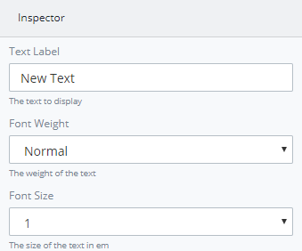

# View the Inspector Pane

The **Text Control Settings**.  

These are Inspector settings for the Text Control:

* **Text Label:** Set by default as "New Text". You can change the name.
* **Font Weight:** Set by default as "Normal". You can change to "Bold".
* **Font Size:** Set by default as "1". You can change the size between 0.5, 1, 1.5 and 2.

For information how to add the **Text** to a ProcessMaker Screen, see [Text Control Settings](https://processmaker.gitbook.io/processmaker-4-community/-LPblkrcFWowWJ6HZdhC/~/edit/drafts/-LRYqWWIxgZmRWpD_gy2/designing-processes/design-forms/screens-builder/control-descriptions/text-control-settings).

