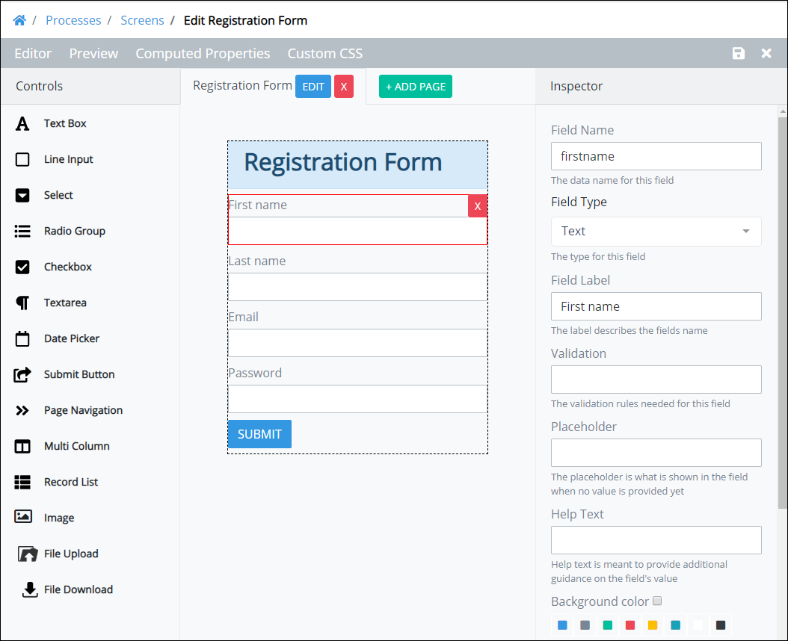

# View the Inspector Panel

## Overview

The **Inspector** panel in Screens Builder displays settings for a selected control when displaying a ProcessMaker Screen in Editor mode. Editor mode is the default mode when a [ProcessMaker Screen is edited](../manage-forms/edit-a-screen.md). The **Inspector** panel displays to the right of a displayed ProcessMaker Screen. Use the **Inspector** panel to [configure settings for controls](control-descriptions/) you place into a ProcessMaker Screen.

## View the Inspector Panel

Follow these steps to view the **Inspector** panel:

1. Ensure you are in Editor mode in the ProcessMaker Screen page for which you want to view the settings of a control. To be in Editor mode, click the **Editor** option from Screen Builder's top menu. Editor mode is the default mode when a [ProcessMaker Screen is edited](../manage-forms/edit-a-screen.md).
2. Select the control in which to view its settings. The **Inspector** panel displays the settings for that control.

## Related Topics







