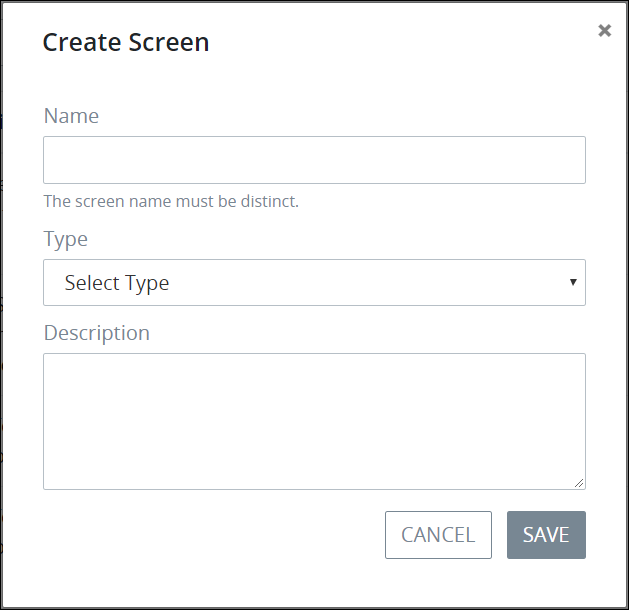

# What is Screens Builder?

Screens Builder allows Process Owners to design screens for their business processes. Any ProcessMaker Screen can be used in any process in your organization.

A ProcessMaker Screen can be any of the following:

* A form
* 

To develop a ProcessMaker Screen, you must be a member of the Process Owner group. Otherwise, the **Processes** option is not available from the top menu that allows you to perform Screen management activities.


## Vivian's Topic


dsafdsfdfdsf


Follow these steps to &lt;do action&gt;:

1. [Add the Text control to the ProcessMaker Screen.](add-a-control-to-a-screen-page.md) The **MAGIC VIVIAN** screen displays.  

   

## Related Topics

