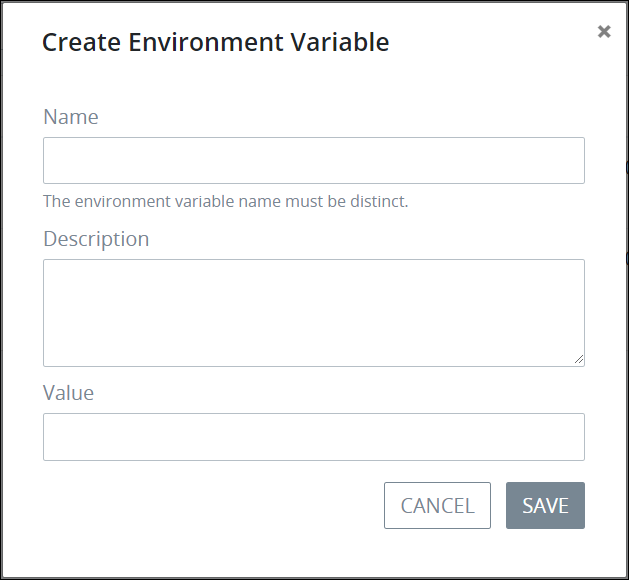

# Create a New Environment Variable


To create a new ProcessMaker Environment Variable, you must be a member of the Process Owner group. Otherwise, the **Processes** option is not available from the top menu that allows you to perform Environment Variable management activities.


## Create a New ProcessMaker Environment Variable

Follow these steps to create a new ProcessMaker Environment Variable:

1. [View your ProcessMaker Environment Variables.](manage-your-environment-variables/view-all-environment-variables.md) The **Environment Variables** page displays.
2. Click the **+ENVIRONMENT VARIABLE** button. The **Create Environment Variable** page displays.  

   

3. Enter in the **Variable Name** field the name of the ProcessMaker Environment Variable. The ProcessMaker Environment Variable name can only contain letters, numbers, and dashes. ~~Character length limitation?~~ This is a required field.
4. Enter in the **Description** field a description for the ProcessMaker Environment Variable. This is a required field. ~~Character length limitation and/or unsupported characters?~~
5. Enter in the **Value** field the value for the ProcessMaker Environment Variable. Entering a value is optional since ProcessMaker Environment Variables are secure, abstract proxies for sensitive information you assign to contain a value that can be determined during an in-progress Request.
6. Click **Save**. The screen closes and the **Environment Variables** page displays with your new Environment Variable.

## Related Topics











