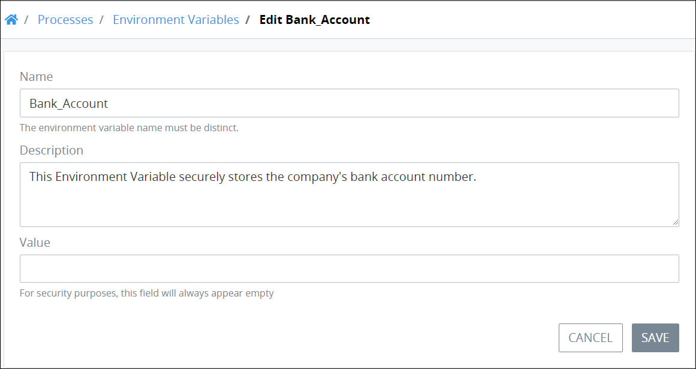

# Edit an Environmental Variable


To edit a ProcessMaker Environment Variable, you must be a member of the Process Owner group. Otherwise, the **Processes** option is not available from the top menu that allows you to perform Environment Variable management activities.


## Edit a ProcessMaker Environment Variable

Follow these steps to edit a ProcessMaker Environment Variable:

1. [View your ProcessMaker Environment Variables.](view-all-environment-variables.md) The **Environment Variables** page displays.
2. Hover your cursor over the ProcessMaker Environment Variable to edit and then click the **Edit** icon. The **Edit Environment Variable** page displays.  

   

3. Edit in the **Variable Name** field the name of the ProcessMaker Environment Variable if necessary.
4. Edit in the **Description** field the description of the ProcessMaker Environment Variable if necessary.
5. Edit or enter in the **Value** field the ProcessMaker Environment Variable value if necessary. Entering or editing a value is optional since ProcessMaker Environment Variables are secure, abstract proxies for sensitive information you assign to contain a value that can be determined during an in-progress Request.
6. Click **Update**. Otherwise, click **Cancel** to cancel any changes.

## Related Topics











