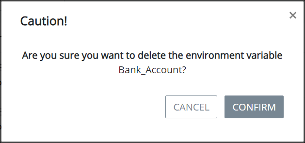

# Remove an Environment Variable


To remove a ProcessMaker Environment Variable, you must be a member of the Process Owner group. Otherwise, the **Processes** option is not available from the top menu that allows you to perform Environment Variable management activities.


## Remove a ProcessMaker Environment Variable


When a ProcessMaker Environment Variable is removed ~~describe what happens and in which conditions a process can be removed.~~

Removing a ProcessMaker Environment Variable from the **Environment Variables** page cannot be undone.


Follow these steps to remove a ProcessMaker Environment Variable:

1. [View your ProcessMaker Environment Variables.](view-all-environment-variables.md) The **Environment Variables** page displays.
2. Hover your cursor over the ProcessMaker Environment Variable to remove and then click the **Remove** icon. The **Caution** screen displays to confirm the removal of the ProcessMaker Environment Variable.  

   

3. Click **Confirm** to remove the ProcessMaker Environment Variable. Otherwise, click **Cancel** to not remove the ProcessMaker Environment Variable.

## Related Topics











