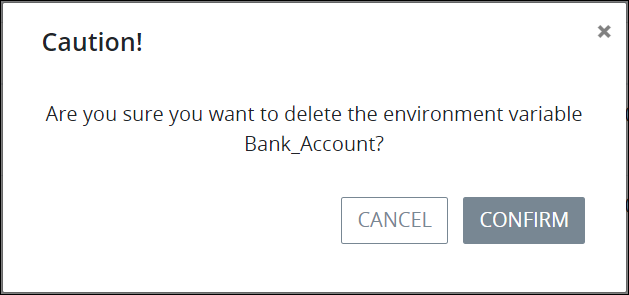

# Delete an Environment Variable

## Remove a ProcessMaker Environment Variable


Your user account or group membership must have the following permissions to delete a ProcessMaker Environment Variable:

* Environment Variables: View Environment Variables
* Environment Variables: Edit Environment Variables
* Environment Variables: Delete Environment Variables

See the ProcessMaker [Environment Variable](../../../processmaker-administration/permission-descriptions-for-users-and-groups.md#environment-variables) permissions or ask your ProcessMaker Administrator for assistance.



When a ProcessMaker Environment Variable is deleted ~~describe what happens and in which conditions a process can be deleted.~~

Deleting a ProcessMaker Environment Variable from the **Environment Variables** page cannot be undone.


Follow these steps to delete a ProcessMaker Environment Variable:

1. [View your ProcessMaker Environment Variables.](view-all-environment-variables.md) The **Environment Variables** page displays.
2. Select the **Delete** iconfor your ProcessMaker Environment Variable. The **Caution** screen displays to confirm the deletion of the ProcessMaker Environment Variable.

   

3. Click **Confirm** to remove the ProcessMaker Environment Variable.

## Related Topics











