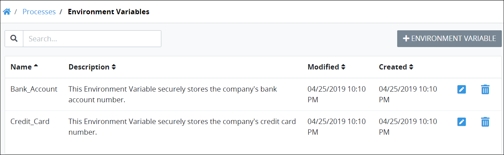

# View All Environment Variables

ProcessMaker displays all ProcessMaker Environment Variables in one table that Process Owners throughout your organization have created. Any ProcessMaker Environment Variable can be used in any process in your organization. Since ProcessMaker Environment Variables are abstract proxies to securely maintain sensitive information during in-progress [Requests](../../../using-processmaker/requests/what-is-a-request.md), Process Owners who create or use ProcessMaker Environment Variables in their processes do not have access to that sensitive information. This makes it easy to manage ProcessMaker Environment Variables.


To view ProcessMaker Environment Variables, you must be a member of the Process Owner group. Otherwise, the **Processes** option is not available from the top menu that allows you to perform Environment Variable management activities.


## View All ProcessMaker Environment Variables 

Follow these steps to view all ProcessMaker Environment Variables in your organization:

1. ​[Log in](https://processmaker.gitbook.io/processmaker-4-community/-LPblkrcFWowWJ6HZdhC/using-processmaker/log-in#log-in) to ProcessMaker.
2. Click the **Processes** option from the top menu. The **Processes** page displays.
3. Click the **Screens** icon. The **Environment Variables** page displays all ProcessMaker Environment Variables created by all Process Owners in your organization.

The **Environment Variables** page displays the following information about ProcessMaker Environment Variables:

* **Name:** The **Name** column displays the name of the ProcessMaker Environment Variable.
* **Description:** The **Description** column displays the description about the ProcessMaker Environment Variable. For information how to edit the ProcessMaker Environment Variable description, see [Edit an Environmental Variable](edit-an-environmental-variable.md).
* **Created At:** The **Created At** column displays the date and time the ProcessMaker Environment Variable was created. ~~Change this label to "Created". Switch the order with "Updated At/Modified" column.~~
* **Updated At:** The **Updated At** column displays the date and time the ProcessMaker Environment Variable was last modified. ~~Change this column label to "Modified".~~


For information how to search for a ProcessMaker Environment Variable, see [Search for an Environment Variable](search-for-an-environment-variable.md).



If no ProcessMaker Environment Variables exist, the following message displays: ~~**You don't have any Environment Variables. Please click on '+ENVIRONMENT VARIABLE' to get started**~~**.**



[Control how tabular information displays.](../../../using-processmaker/control-how-requests-display-in-a-tab.md)


## Related Topics













