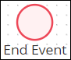

# Add and Configure Event Elements

## Add a Start Event Element


### Don't Know What a Start Event Element Is?

See [Process Modeling Element Descriptions](process-modeling-element-descriptions.md) for a description of the [Start Event](process-modeling-element-descriptions.md#start-event) element.

### Permissions Required to Do This Task

Your user account or group membership must have the following permissions to add a Start Event element to the Process model:

* Processes: View Processes
* Processes: Edit Processes

Ask your ProcessMaker Administrator for assistance if necessary.


Follow these steps to add a Start Event element to the Process model:

1. [View your Processes](https://processmaker.gitbook.io/processmaker-4-community/-LPblkrcFWowWJ6HZdhC/~/drafts/-LRhVZm0ddxDcGGdN5ZN/primary/designing-processes/viewing-processes/view-the-list-of-processes/view-your-processes#view-all-processes). The **Processes** page displays.
2. [Create a new Process](../../viewing-processes/create-a-process.md) or click the **Open Modeler** iconto edit the selected Process model. Process Modeler displays.
3. Locate the **Start Event** element  in the **BPMN** left side bar. Drag and drop the element to where in the Process model you want to place it. If a Pool element is in your Process model, the Start Event element cannot be placed outside of the Pool element. The event has been added to the Process model.

After the element is placed into the Process model, you may move it by selecting it, hold the cursor, and then dragging it to the new location.


If the element is placed inside of a Pool element, the Start Event element cannot be moved outside of the Pool element. If you attempt to do so, Process Modeler places the Start Element inside the Pool element closest to where you attempted to move it.


## Add an End Event Element


### Don't Know What an End Event Is?

See [Process Modeling Element Descriptions](process-modeling-element-descriptions.md) for a description of the [End Event](process-modeling-element-descriptions.md#end-event) element.

### Permissions Required to Do This Task

Your user account or group membership must have the following permissions to add an End Event element to the Process model:

* Processes: View Processes
* Processes: Edit Processes

Ask your ProcessMaker Administrator for assistance if necessary.


Follow these steps to add an End Event element to the Process model:

1. [View your Processes](https://processmaker.gitbook.io/processmaker-4-community/-LPblkrcFWowWJ6HZdhC/~/drafts/-LRhVZm0ddxDcGGdN5ZN/primary/designing-processes/viewing-processes/view-the-list-of-processes/view-your-processes#view-all-processes). The **Processes** page displays.
2. [Create a new Process](../../viewing-processes/create-a-process.md) or click the **Open Modeler** iconto edit the selected Process model. Process Modeler displays.
3. Locate the **End Event** element  in the **BPMN** left side bar. Drag and drop the element to where in the Process model you want to place it. If a Pool element is in your Process model, the End Event element cannot be placed outside of the Pool element. The event has been added to the Process model.

After the element is placed into the Process model, you may move it by selecting it, hold the cursor, and then dragging it to the new location.


If the element is placed inside of a Pool element, the End Event element cannot be moved outside of the Pool element. If you attempt to do so, Process Modeler places the End Event element inside the Pool element closest to where you attempted to move it.


## Configure an Event Element


Your user account or group membership must have the following permissions to configure an Event element:

* Processes: View Processes
* Processes: Edit Processes

Ask your ProcessMaker Administrator for assistance if necessary.


### Edit the Identifier Value

Process Modeler automatically assigns a unique value to each Process element added to a Process model. However, an element's identifier value can be changed as long as it is unique.


All identifier values for all elements in the Process model must be unique.


Follow these steps to edit the identifier value for an Event element:

1. Place a [Start Event](add-and-configure-an-event-element.md#add-a-start-event-element) or [End Event](add-and-configure-an-event-element.md#add-an-end-event-element) element into your Process model.
2. Select the Event element in which to edit its identifier value. The current Event identifier value displays in the **Identifier** field in the right side bar.
3. In the **Identifier** field, edit the selected Event element's identifier value and then press **Enter**. The identifier value is changed.

### Edit the Element Name

An element name is a human-readable reference for a Process element. Process Modeler automatically assigns the name of a Process element with its element type. However, an element's name can be changed.

Follow these steps to edit the name for an Event element:

1. Place a [Start Event](add-and-configure-an-event-element.md#add-a-start-event-element) or [End Event](add-and-configure-an-event-element.md#add-an-end-event-element) element into your Process model.
2. Select the Event element in which to edit its name. The current name displays in the **Name** field in the right side bar.
3. In the **Name** field, edit the selected Event element's name and then press **Enter**. The element's name is changed.

## Related Topics







