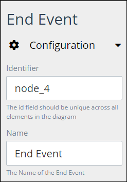
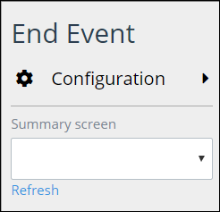

# Add and Configure End Event Elements

## Add an End Event Element


### Don't Know What an End Event Is?

See [Process Modeling Element Descriptions](process-modeling-element-descriptions.md) for a description of the [End Event](process-modeling-element-descriptions.md#end-event) element.

### Permissions Required to Do This Task

Your user account or group membership must have the following permissions to add an End Event element to the Process model:

* Processes: View Processes
* Processes: Edit Processes

See the [Process](../../../processmaker-administration/permission-descriptions-for-users-and-groups.md#processes) permissions or ask your ProcessMaker Administrator for assistance.


Follow these steps to add an End Event element to the Process model:

1. [View your Processes](https://processmaker.gitbook.io/processmaker-4-community/-LPblkrcFWowWJ6HZdhC/~/drafts/-LRhVZm0ddxDcGGdN5ZN/primary/designing-processes/viewing-processes/view-the-list-of-processes/view-your-processes#view-all-processes). The **Processes** page displays.
2. [Create a new Process](../../viewing-processes/view-the-list-of-processes/create-a-process.md) or click the **Open Modeler** iconto edit the selected Process model. Process Modeler displays.
3. Locate the **End Event** element in the **BPMN** panel.

   

4. Drag the element to where in the Process model canvas that you want to place it. If a Pool element is in your Process model, the End Event element cannot be placed outside of the Pool element.

After the element is placed into the Process model, you may move it by dragging it to the new location.


Moving an End Event element has the following limitations in regards to the following Process model elements:

* **Pool element:** If the End Event element is inside of a [Pool](process-modeling-element-descriptions.md#pool) element, it cannot be moved outside of the Pool element. If you attempt to do so, Process Modeler places the End Event element inside the Pool element closest to where you attempted to move it.
* **Lane element:** If the End Event element is inside of a Lane element, it can be moved to another Lane element in the same Pool element. However, the End Event element cannot be move outside of the Pool element.


## Configure an Event Element


Your user account or group membership must have the following permissions to configure an End Event element:

* Processes: View Processes
* Processes: Edit Processes

See the [Process](../../../processmaker-administration/permission-descriptions-for-users-and-groups.md#processes) permissions or ask your ProcessMaker Administrator for assistance.


### Edit the Identifier Value

Process Modeler automatically assigns a unique value to each Process element added to a Process model. However, an element's identifier value can be changed if it is unique.


All identifier values for all elements in the Process model must be unique.


Follow these steps to edit the identifier value for an End Event element:

1. Select the End Event element from the Process model in which to edit its identifier value.
2. Expand the **Configuration** setting section if it is not presently expanded. The **Identifier** field displays. This is a required field.  

   

3. In the **Identifier** field, edit the End Event element's identifier to a unique value from all elements in the Process model and then press **Enter**. The element's identifier value is changed.

### Edit the Element Name

An element name is a human-readable reference for a Process element. Process Modeler automatically assigns the name of a Process element with its element type. However, an element's name can be changed.

Follow these steps to edit the name for an End Event element:

1. Select the End Event element from the Process model in which to edit its name.
2. Expand the **Configuration** setting section if it is not presently expanded. The **Name** field displays.  

   

3. In the **Name** field, edit the selected element's name and then press **Enter**. The element's name is changed.

### Select the ProcessMaker Screen That Summarizes a Completed Request

After a [Request](../../../using-processmaker/requests/what-is-a-request.md) completes when an End Event element triggers, a [ProcessMaker Screen](../../design-forms/what-is-a-form.md) can display a summary of the completed Request. If a Process model has multiple End Event elements, then a different ProcessMaker Screen can display the Request summary.

For example, if an End Event element triggers from Lane 1 of a Pool element, then use a different ProcessMaker Screen to display the Request summary than if an End Event element triggers from Lane 2.

Follow these steps to select the ProcessMaker Screen that displays when a Request completes in an End Event element:

1. Select the End Event element from the Process model in which to select the ProcessMaker Screen that displays when that End Event element is triggered, thereby completing that Request.
2. The **Summary screen** drop-down menu displays below the **Configuration** setting section.  

   

3. From the **Summary screen** drop-down menu, select the ProcessMaker Screen that has been designed to display Request summaries for that Process when that End Event element is triggered. Click the **Refresh** link below the **Summary screen** drop-down menu to refresh the options that display in the drop-down menu if necessary.

   Note that another End Event element located elsewhere in the Process model, such as another Pool or Lane element, may reference a different ProcessMaker Screen to display Request summaries when it is triggered.

## Related Topics













