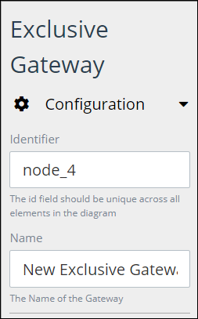

# Add and Configure Exclusive Gateway Elements

## Add an Exclusive Gateway Element


### Don't Know What an Exclusive Gateway Element Is?

See [Process Modeling Element Descriptions](process-modeling-element-descriptions.md) for a description of the [Exclusive Gateway](process-modeling-element-descriptions.md#exclusive-gateway) element.

### Permissions Required to Do This Task

Your user account or group membership must have the following permissions to add an Exclusive Gateway element to the Process model:

* Processes: View Processes
* Processes: Edit Processes

See the [Process](../../../processmaker-administration/permission-descriptions-for-users-and-groups.md#processes) permissions or ask your ProcessMaker Administrator for assistance.


Follow these steps to add an Exclusive Gateway element to the Process model:

1. [View your Processes](https://processmaker.gitbook.io/processmaker-4-community/-LPblkrcFWowWJ6HZdhC/~/drafts/-LRhVZm0ddxDcGGdN5ZN/primary/designing-processes/viewing-processes/view-the-list-of-processes/view-your-processes#view-all-processes). The **Processes** page displays.
2. [Create a new Process](../../viewing-processes/view-the-list-of-processes/create-a-process.md) or click the **Open Modeler** iconto edit the selected Process model. Process Modeler displays.
3. Locate the **Exclusive Gateway** element in the **BPMN** panel.

   

4. Drag the element to where in the Process model you want to place it. If a Pool element is in your Process model, the Exclusive Gateway element cannot be placed outside of the Pool element.

After the element is placed into the Process model, you may move it by dragging it to the new location.


Moving an Exclusive Gateway element has the following limitations in regards to the following Process model elements:

* **Pool element:** If the Exclusive Gateway element is inside of a [Pool](process-modeling-element-descriptions.md#pool) element, it cannot be moved outside of the Pool element. If you attempt to do so, Process Modeler places the Exclusive Gateway element inside the Pool element closest to where you attempted to move it.
* **Lane element:** If the Exclusive Gateway element is inside of a Lane element, it can be moved to another Lane element in the same Pool element. However, the Exclusive Gateway element cannot be move outside of the Pool element.


## Configure an Exclusive Gateway Element


### Looking for Information How to Configure Exclusive Gateway Conditions?

See [Configure a Sequence Flow from an Exclusive Gateway Element](the-quick-toolbar.md#configure-a-sequence-flow-from-an-exclusive-gateway-element).

### Permissions Required to Do This Task

Your user account or group membership must have the following permissions to configure an Exclusive Gateway element:

* Processes: View Processes
* Processes: Edit Processes

See the [Process](../../../processmaker-administration/permission-descriptions-for-users-and-groups.md#processes) permissions or ask your ProcessMaker Administrator for assistance.


### Edit the Identifier Value

Process Modeler automatically assigns a unique value to each Process element added to a Process model. However, an element's identifier value can be changed if it is unique.


All identifier values for all elements in the Process model must be unique.


Follow these steps to edit the identifier value for an Exclusive Gateway element:

1. Select the Exclusive Gateway element from the Process model in which to edit its identifier value.
2. Expand the **Configuration** setting section if it is not presently expanded. The **Identifier** field displays.  

   

3. In the **Identifier** field, edit the Exclusive Gateway element's identifier to a unique value from all elements in the Process model and then press **Enter**. The element's identifier value is changed.

### Edit the Element Name

An element name is a human-readable reference for a Process element. Process Modeler automatically assigns the name of a Process element with its element type. However, an element's name can be changed.

Follow these steps to edit the name for an Exclusive Gateway element:

1. Select the Exclusive Gateway element from the Process model in which to edit its name.
2. Expand the **Configuration** setting section if it is not presently expanded. The **Name** field displays.  

   

3. In the **Name** field, edit the selected element's name and then press **Enter**. The element's name is changed.

## Related Topics







