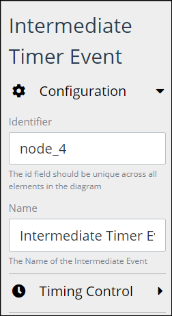

# Add and Configure Intermediate Timer Event Elements

## Add an Intermediate Timer Event Element


### Don't Know What an Intermediate Timer Event Element Is?

See [Process Modeling Element Descriptions](process-modeling-element-descriptions.md) for a description of the [Intermediate Timer Event](process-modeling-element-descriptions.md#intermediate-timer-event) element.

### Permissions Required to Do This Task

Your user account or group membership must have the following permissions to add an Intermediate Timer Event element to the Process model:

* Processes: View Processes
* Processes: Edit Processes

See the [Process](../../../processmaker-administration/permission-descriptions-for-users-and-groups.md#processes) permissions or ask your ProcessMaker Administrator for assistance.


Follow these steps to add an Intermediate Timer Event element to the Process model:

1. [View your Processes](https://processmaker.gitbook.io/processmaker-4-community/-LPblkrcFWowWJ6HZdhC/~/drafts/-LRhVZm0ddxDcGGdN5ZN/primary/designing-processes/viewing-processes/view-the-list-of-processes/view-your-processes#view-all-processes). The **Processes** page displays.
2. [Create a new Process](../../viewing-processes/view-the-list-of-processes/create-a-process.md) or click the **Open Modeler** iconto edit the selected Process model. Process Modeler displays.
3. Locate the **Intermediate Timer Event** element in the **BPMN** panel.  

   

4. Drag the element to where in the Process model you want to place it. If a Pool element is in your Process model, the Intermediate Timer Event element cannot be placed outside of the Pool element.

After the element is placed into the Process model, you may move it by dragging it to the new location.


Moving an Intermediate Timer Event element has the following limitations in regards to the following Process model elements:

* **Pool element:** If the Intermediate Timer Event element is inside of a [Pool](process-modeling-element-descriptions.md#pool) element, it cannot be moved outside of the Pool element. If you attempt to do so, Process Modeler places the Intermediate Timer Event element inside the Pool element closest to where you attempted to move it.
* **Lane element:** If the Intermediate Timer Event element is inside of a Lane element, it can be moved to another Lane element in the same Pool element. However, the Intermediate Timer Event element cannot be move outside of the Pool element.


## Configure an Intermediate Timer Event Element


Your user account or group membership must have the following permissions to configure an Intermediate Timer Event element:

* Processes: View Processes
* Processes: Edit Processes

See the [Process](../../../processmaker-administration/permission-descriptions-for-users-and-groups.md#processes) permissions or ask your ProcessMaker Administrator for assistance.


### Edit the Identifier Value

Process Modeler automatically assigns a unique value to each Process element added to a Process model. However, an element's identifier value can be changed if it is unique.


All identifier values for all elements in the Process model must be unique.


Follow these steps to edit the identifier value for an Intermediate Timer Event element:

1. Select the Intermediate Timer Event element from the Process model in which to edit its identifier value.
2. Expand the **Configuration** setting section if it is not presently expanded. The **Identifier** field displays. This is a required field.  

   

3. In the **Identifier** field, edit the Intermediate Timer Event element's identifier to a unique value from all elements in the Process model and then press **Enter**. The element's identifier value is changed.

### Edit the Element Name

An element name is a human-readable reference for a Process element. Process Modeler automatically assigns the name of a Process element with its element type. However, an element's name can be changed.

Follow these steps to edit the name for an Intermediate Timer Event element:

1. Select the Intermediate Timer Event element from the Process model in which to edit its name.
2. Expand the **Configuration** setting section if it is not presently expanded. The **Name** field displays.  

   

3. In the **Name** field, edit the selected element's name and then press **Enter**. The element's name is changed.

## Set the Timer Controls


Your user account or group membership must have the following permissions to set the timer controls for an Intermediate Timer Event element:

* Processes: View Processes
* Processes: Edit Processes

See the [Process](../../../processmaker-administration/permission-descriptions-for-users-and-groups.md#processes) permissions or ask your ProcessMaker Administrator for assistance.


Set the timer controls for an Intermediate Timer Event element using one of the following methods:

* Set an interval in which to delay triggering the Intermediate Time Event element in a specified number of days, weeks, months, or years.
* Set the date and hour when the trigger the Intermediate Timer Event element.

Follow these steps to set the timer controls for an Intermediate Timer Event element:

1. Select the Intermediate Timer Event element from the Process model in which to set its timer controls.
2. Expand the **Timing Control** setting section.  

   

3. Do one of the following to set the timer control:
   * **Delay the timer:** From the **Type** drop-down menu, select the **Delay** option. The **Delay** option is the default setting. When the **Delay** option is selected from the **Type** drop-down menu, the **Delay** setting displays.  

     

     From the **Delay** setting, select at which interval of time to trigger the Intermediate Timer Event element. **1** is the default setting. Then select one of the following time periods for that element to trigger:

     * Day
     * Week
     * Month
     * Year

   * **Set date and time to trigger the Intermediate Start Event element:** From the **Type** drop-down menu, select the **Date/Time** option. The **Wait until specific date/time** setting displays.  

     

     Do the following:

     * From the **Wait until specific date/time** field, select the date to trigger the Intermediate Timer Event element. If this field has not been previously set, the current date is the default.
     * Below the **Wait until specific date/time** field, set the hour of that date to trigger the Intermediate Timer Event element.

## Related Topics









