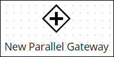
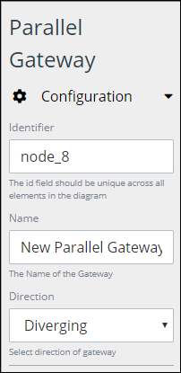

# Add and Configure Parallel Gateway Elements

## Add a Parallel Gateway Element


### Don't Know What a Parallel Gateway Element Is?

See [Process Modeling Element Descriptions](process-modeling-element-descriptions.md) for a description of the [Parallel Gateway](process-modeling-element-descriptions.md#parallel-gateway) element.

### Permissions Required

Your user account or group membership must have the following permissions to add a Parallel Gateway element to the Process model:

* Processes: View Processes
* Processes: Edit Processes

See the [Process](../../../processmaker-administration/permission-descriptions-for-users-and-groups.md#processes) permissions or ask your ProcessMaker Administrator for assistance.


Follow these steps to add a Parallel Gateway element to the Process model:

1. [View your Processes](https://processmaker.gitbook.io/processmaker-4-community/-LPblkrcFWowWJ6HZdhC/~/drafts/-LRhVZm0ddxDcGGdN5ZN/primary/designing-processes/viewing-processes/view-the-list-of-processes/view-your-processes#view-all-processes). The **Processes** page displays.
2. [Create a new Process](../../viewing-processes/view-the-list-of-processes/create-a-process.md) or click the **Open Modeler** iconto edit the selected Process model. Process Modeler displays.
3. Locate the **Parallel Gateway** element in the **BPMN** panel.  

   

4. Drag the element to where in the Process model canvas that you want to place it. If a Pool element is in your Process model, the Parallel Gateway element cannot be placed outside of the Pool element.

After the element is placed into the Process model, you may move it by dragging it to the new location.


Moving a Parallel Gateway element has the following limitations in regards to the following Process model elements:

* **Pool element:** If the Parallel Gateway element is inside of a [Pool](process-modeling-element-descriptions.md#pool) element, it cannot be moved outside of the Pool element. If you attempt to do so, Process Modeler places the Parallel Gateway element inside the Pool element closest to where you attempted to move it.
* **Lane element:** If the Parallel Gateway element is inside of a Lane element, it can be moved to another Lane element in the same Pool element. However, the Parallel Gateway element cannot be move outside of the Pool element.


## Configure a Parallel Gateway Element


Your user account or group membership must have the following permissions to configure a Parallel Gateway element:

* Processes: View Processes
* Processes: Edit Processes

See the [Process](../../../processmaker-administration/permission-descriptions-for-users-and-groups.md#processes) permissions or ask your ProcessMaker Administrator for assistance.


### Edit the Identifier Value

Process Modeler automatically assigns a unique value to each Process element added to a Process model. However, an element's identifier value can be changed if it is unique.


All identifier values for all elements in the Process model must be unique.


Follow these steps to edit the identifier value for a Parallel Gateway element:

1. Select the Parallel Gateway element from the Process model in which to edit its identifier value.
2. Expand the **Configuration** setting section if it is not presently expanded. The **Identifier** field displays. This is a required field.  

   

3. In the **Identifier** field, edit the Parallel Gateway element's identifier to a unique value from all elements in the Process model and then press **Enter**. The element's identifier value is changed.

### Edit the Element Name

An element name is a human-readable reference for a Process element. Process Modeler automatically assigns the name of a Process element with its element type. However, an element's name can be changed.

Follow these steps to edit the name for a Parallel Gateway element:

1. Select the Parallel Gateway element from the Process model in which to edit its name.
2. Expand the **Configuration** setting section if it is not presently expanded. The **Name** field displays.  

   

3. In the **Name** field, edit the selected element's name and then press **Enter**. The element's name is changed.

### Indicate Workflow Direction

Indicate if the workflow direction for the Parallel Gateway is converging or diverging:

* **Converging:** Converging workflow indicates incoming [Sequence Flows](process-modeling-element-descriptions.md#sequence-flow) to the Parallel Gateway element. ~~Indicate one of the following:~~
  * ~~The first incoming Sequence Flow element that triggers to the Parallel Gateway element thereby triggers the Parallel Gateway element. This implies that any of the preceding elements routing to the Parallel Gateway element can trigger the gateway.~~
  * ~~All incoming Sequence Flow elements to the Parallel Gateway element must trigger before the Parallel Gateway triggers. This implies that all of the preceding elements routing to the Parallel Gateway element have triggered to trigger the gateway.~~
* **Diverging:** Diverging workflow indicates outgoing Sequence Flow elements from the Parallel Gateway element. When a Parallel Gateway triggers, all outgoing Sequence Flow elements from the gateway trigger simultaneously without exception. Conditions cannot be placed on any outgoing Sequence Flow elements from the Parallel Gateway element.

Follow these steps to indicate the workflow direction for a Parallel Gateway element:

1. Select the Parallel Gateway element from the Process model in which to indicate the workflow direction.
2. Expand the **Configuration** setting section if it is not presently expanded. The **Direction** drop-down menu displays.  

   

3. From the **Direction** drop-down menu, select from one of the following options:
   * **Diverging:** Select the **Diverging** option to indicate that the workflow direction is for outgoing Sequence Flow elements. When this option is selected, all outgoing Sequence Flow elements from the Parallel Gateway element trigger simultaneously without exception.
   * **Converging:** Select the **Converging** option to indicate the workflow direction is for incoming Sequence Flow elements. ~~When this option is selected, the **Sequence Flow Trigger Condition** drop-down menu displays.~~

     ~~From the **Sequence Flow Trigger Condition** drop-down menu, select how the incoming Sequence Flow element\(s\) triggers the Parallel Gateway element:~~

     * ~~**First Sequence Flow:** Select the **First Sequence Flow** option to indicate that the first incoming Sequence Flow element that triggers to the Parallel Gateway element thereby triggers the Parallel Gateway element.~~
     * ~~**All Sequence Flows:** Select the **All Sequence Flows** option to indicate that all incoming Sequence Flow elements to the Parallel Gateway element must trigger before the Parallel Gateway triggers.~~
4. ~~Are there more steps?~~

## Related Topics









