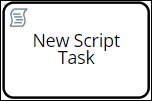
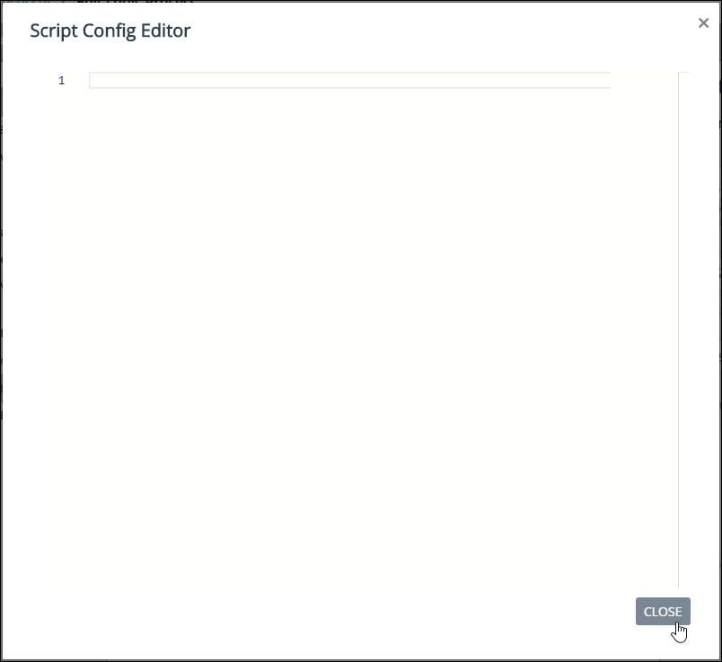

# Add and Configure Script Task Elements

## Add a Script Task Element


For a description of the [Script Task](process-modeling-element-descriptions.md#script-task) element, see [Process Modeling Element Descriptions](process-modeling-element-descriptions.md).


Follow these steps to add a Script Task element to the process model:

1. [View your processes](https://processmaker.gitbook.io/processmaker-4-community/-LPblkrcFWowWJ6HZdhC/~/drafts/-LRhVZm0ddxDcGGdN5ZN/primary/designing-processes/viewing-processes/view-the-list-of-processes/view-your-processes#view-all-processes). The **Processes** page displays.
2. [Create a new process](../../viewing-processes/create-a-process.md) or [select the process name of an existing process to open it](../../viewing-processes/view-the-list-of-processes/view-your-processes.md#view-all-processes). Process Modeler displays.
3. Locate the **Script Task** element  in the **BPMN** left side bar. Drag and drop the element to where in the process model you want to place it. The event has been added to the process model.

## Configure a Script Task Element

### Edit the Identifier Value

Process Modeler assigns a value to a process model or process element to identify that element. Process Modeler automatically assigns a unique value to each process element added to a process model. However, an element's identifier value can be changed as long as it is unique.


All identifier values for all elements in the process model must be unique.


Follow these steps to edit the identifier value for a Script Task element:

1. Place a [Script Task](add-and-configure-script-task-elements.md#add-a-script-task-element) element into your process model.
2. Select the Script Task element in which to edit its identifier value. The current Script Task identifier value displays in the **Identifier** field in the right side bar.
3. In the **Identifier** field, edit the selected Script Task element's identifier value and then press **Enter**. The identifier value is changed.

### Edit the Element Name

An element name is a human-readable reference for a process element. Process Modeler automatically assigns the name of a process element with its element type. However, an element's name can be changed.

Follow these steps to edit the name for a Script Task element:

1. Place a [Script Task](add-and-configure-script-task-elements.md#add-a-script-task-element) element into your process model.
2. Select the Script Task element in which to edit its name. The current name displays in the **Name** field in the right side bar.
3. In the **Name** field, edit the selected Script Task element's name and then press **Enter**. The element's name is changed.

### Select the ProcessMaker Script for a Script Task Element

Since Script Task elements are designed to run a ProcessMaker Script, specify which ProcessMaker Script a selected Script Task element uses. A ProcessMaker Script must already exist before it can be selected for use in a Script Task element.


For information about ProcessMaker Scripts, see [What is a Script?](../../scripts/what-is-a-script.md).



Ensure to select a ProcessMaker Script for each Script Task element in your process model. If a ProcessMaker Script is not specified and Requests are started for that process, Requests associated with that process will stall and never complete because there is no ProcessMaker Script to run for the Script Task element\(s\).


Follow these steps to select a ProcessMaker Script for a Script Task element:

1. Place a [Script Task](add-and-configure-script-task-elements.md#add-a-script-task-element) element into your process model.
2. Select the Script Task element in which to specify its ProcessMaker Script. Options for the Script Task element display in the right side bar.
3. In the **Script** field, select which ProcessMaker Script that Script Task element uses. The ProcessMaker Script is selected.


Click the **Refresh** link below the **Script** field to refresh the options in the drop-down.



If no ProcessMaker Scripts exist, the drop-down contains no options. Ensure to select and configure a ProcessMaker Script for every Script Task element in the process model before making the process active.


### Configure the ProcessMaker Script Selected for a Script Task Element

After [selecting the ProcessMaker Script for the Script Task element](add-and-configure-script-task-elements.md#select-the-processmaker-script-for-a-script-task-element), optionally provide a JSON script that configures variable values for the selected ProcessMaker Script. Providing a JSON script from the Script Task is identical to providing JSON configuration script in the **Script Config JSON** panel in Scripts Editor for a ProcessMaker Script.


For information about ProcessMaker Scripts, see [What is a Script?](../../scripts/what-is-a-script.md).

For information about adding a JSON configuration script for a ProcessMaker Script, see [Scripts Editor](../../scripts/scripts-editor.md#enter-other-json-data-as-input-to-your-processmaker-script).


If a JSON script exists in the Script Task element, that script is used for the ProcessMaker Script. An existing JSON configuration script displays in the **Script Configuration** option for a selected Script Task element.


The JSON script in the Script Task element overrides any JSON script entered in the **Script Config JSON** panel in Scripts Editor for the associated ProcessMaker Script.


Follow these steps to enter or edit a JSON configuration script for a Script Task element:

1. Place a [Script Task](add-and-configure-script-task-elements.md#add-a-script-task-element) element into your process model.
2. Select the Script Task element in which to specify its ProcessMaker Script. Options for the Script Task element display in the right side bar.
3. [Select the ProcessMaker Script for the Script Task element.](add-and-configure-script-task-elements.md#select-the-processmaker-script-for-a-script-task-element)
4. Click the iconbeside the **Script Configuration** option. The **Script Config Editor** displays.  

   

5. Enter your JSON configuration script. Use the scroll panel to the right of the ProcessMaker script to scroll to different sections of the script if necessary. This is useful especially when you are editing a long ProcessMaker Script.
6. Click **Close** or the Close icon. The JSON configuration script is saved.


You can enter your JSON configuration script directly into the **Script Configuration** option instead of using the **Script Config Editor**.


## Related Topics











